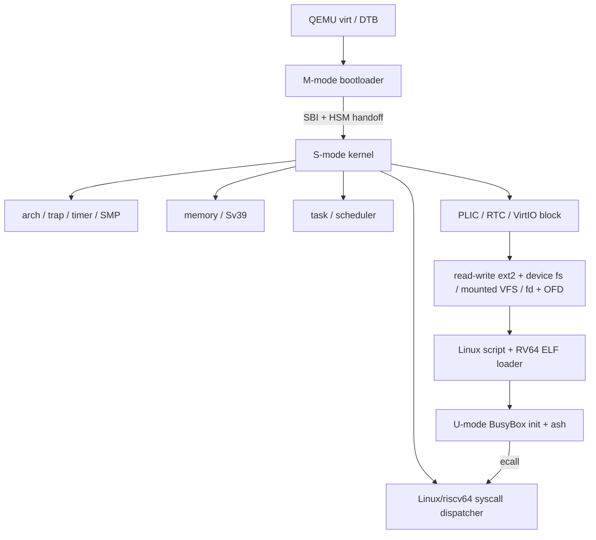

# LiteOS 当前架构

> 更新日期：2026-07-12（Asia/Shanghai）
>
> 目标平台：QEMU `virt`、RV64GC；hart 集合来自 DTB，容量受可用内存和 SBI/PLIC/CLINT 表达能力约束
> 状态边界：本文是当前仓库事实的权威描述；`phase-*.md` 是各阶段当时的审计记录，其“修改前”或“下一阶段”段落不代表当前能力。

## 1. 架构原则

LiteOS 只在能同时证明编号/格式、状态机、所有权、生命周期和并发语义时暴露能力。当前架构遵守：

1. M-mode firmware、S-mode kernel 和 U-mode program 之间只使用明确 ABI。
2. 每个复合状态只有一个权威 owner；runqueue/current/wait membership 不用全局任务表推导。
3. 硬件地址、DMA、trap context 和用户指针不暴露可逃逸的静态可变引用。
4. 不用私有 syscall、错号转发、忽略 flags 或同名 stub 填补标准语义。
5. 当前未形成闭环的功能返回 `-ENOSYS` 或不存在于公共接口中。

## 2. 组件和依赖方向

依赖不反向跨层：driver 不依赖 syscall，task 不依赖 GUI/设备策略，VFS 不保存用户 fd 假象。

## 3. M-mode bootloader

`bootloader/` 基于 RustSBI，它只负责 supervisor execution environment：

- 任意合法 cold-boot hart 使用原子状态竞争全局初始化所有权。
- 清 BSS、解析 DTB、初始化 UART/CLINT/QEMU reset、发布不可变 RustSBI 实例。
- 验证 DTB hart mask；单字 SBI mask 只能表达 `usize::BITS` 个 hart ID，这个 ABI 边界不表示实际核数。
- 每个可表达 hart ID 有独占 M-mode trap stack 和 local HSM state；cold-boot hart 等待全部 DTB local state ready，只启动自己进入 kernel。
- 其他 DTB hart 保持 HSM `STOPPED`，直到 kernel 发起 `hart_start`。
- 实现 RustSBI 对外报告的 SBI 2.0 子集：Base、TIME、IPI、RFENCE、HSM、SRST、DBCN。
- RFENCE 向每个目标 hart 发布请求并同步等待 ack；普通 IPI 只负责唤醒。
- PMP 将 firmware 与 S-mode kernel 范围分开，最终通过 `mret` 进入 S-mode。

它不是通用真实硬件 firmware；CLINT、QEMU reset 和物理地址布局都针对 `virt` machine。

## 4. Kernel 启动与 SMP

kernel 只有一个 `_start`。动态 hart table 尚未发布时，唯一 cold-boot hart 使用 linker early stack；table 发布后，secondary 在无栈汇编阶段按 `a0` hart ID 查找动态 startup stack，再设置 `gp/tp` 并进入 `kmain_secondary`。唯一 boot owner 执行：

1. trap vector 和日志；
2. DTB 发布与 required SBI extension probe；
3. kernel allocator，然后按 DTB mask 构造动态 `HartTopology`；
4. frame allocator 和 kernel Sv39 page table；
5. RTC/monotonic timer；
6. root namespace VFS；
7. PLIC 与 VirtIO block discovery；
8. composition root 将 primary block adapter 装配为 ext2 root，再把 device filesystem 与 procfs adapter 分别挂载到 `/dev`、`/proc`；
9. 动态 `ProcessorTopology`，然后构造 PID 1 `/bin/init` 并入队。

`HartTopology` 持有每个 DTB hart 的 startup stack、softirq pending 和 online/active 状态；task module 的 `ProcessorTopology` 按同一 DTB 集合独立拥有 processor slot，避免 arch 反向依赖 scheduler。boot hart 用同一个 `_start` 地址、DTB 地址作为 opaque，通过 SBI HSM 逐个启动 mask 中的 secondary。`INIT_READY.store(Release)` 一次性发布全局对象；secondary 用 Acquire 消费后激活共享 kernel page table。boot hart 只有在动态 online mask 等于 DTB mask 后才继续；每个 hart 完成同步 RFENCE 后进入 `run_tasks()`。

## 5. Trap 与上下文

- U-mode trap 通过每个地址空间共享的 trampoline 进入，切换 kernel `satp` 和 kernel stack。
- `TrapContext` 保存 32 个 GPR（包括用户 `gp/tp`）、32 个 FP register、`fcsr`、`sepc/sstatus` 和 kernel return metadata。
- 进入 kernel 后恢复 kernel `gp/tp`，返回前恢复用户值，因此 U-mode `tp` 可作为未来 TLS base，但当前未初始化 TLS。
- S-mode trap 不开启 nested interrupt；kernel exception fail-stop，用户 illegal/breakpoint/page fault 只终止当前 task。
- timer hardirq 只发布 per-hart deferred work 并触发 software interrupt；user-return 与 scheduler idle 共用同一 consumer，不在 hardirq 中切换。
- external interrupt 只从当前 hart 的 QEMU S-mode PLIC context `2 * hart + 1` claim/complete。

## 6. 并发与同步

- `LocalIrqGuard` 使用 RAII 保存/恢复本地 SIE，并且不可跨 hart 移动。
- `IrqMutex<T>` 的获取顺序固定为 disable local interrupt -> spin mutex；释放顺序反向，防止同 hart interrupt reentrancy。
- interrupt-safe lock 是非睡眠锁；guard 内不得调度、阻塞 I/O 或等待可睡眠对象。
- per-hart `Processor` 的 current/runqueue/idle context 只由 owner hart 在 SIE 关闭时可变访问。
- scheduler 的 `ProcessorTopology` 与 softirq 的 `HartTopology` 都只为 DTB 中真实存在的 hart 建槽；稀疏 hart ID 不产生占位 processor。
- 远端 task 只通过 inbound mailbox + SBI IPI 发布，不跨 hart 借用其他 scheduler。
- Release/Acquire 只用于初始化、online mask、mailbox 和 RFENCE 等真正发布关系；Relaxed 只用于负载 hint/计数。

## 7. 内存模型

### 7.1 Kernel

- kernel linker 区间按 `.text=RX`、`.rodata=R`、`.data/.bss=RW+NX` 映射。
- kernel 剩余物理内存在 physmap 中 RW+NX 映射。
- 4 MiB buddy allocator 服务 kernel `alloc`；独立 frame allocator 用 `FrameTracker` RAII 拥有物理页。
- 每个 DTB hart 的动态 startup stack 从 kernel allocator 分配；boot hart 在构造 topology 前只使用唯一 linker early stack。
- 新 frame 在交给页表、ELF BSS 或 DMA 前清零。

### 7.2 User

- 每个 Process 拥有独立 Sv39 `MemorySet`，当前 ASID 固定为 0。
- `MemorySet` 的有序 VMA 表唯一拥有 ELF LOAD、`brk` heap、256 KiB RW+NX stack、anonymous/file private mapping、supervisor-only TrapContext 与 kernel mapping；不存在独立 heap/mmap shadow registry。
- ELF LOAD 权限来自 program header，W+X 直接拒绝。
- user copyin/copyout 在 AddressSpace lock 内逐页验证 `U|R`/`U|W`，只返回 owned bytes，不返回指向用户 frame 的 Rust reference。
- 页表修改用本地 `sfence.vma` + 同步 SBI RFENCE 刷新所有 online hart。
- anonymous private `mmap` eager 分配清零页，file private mmap 从 inode 建立私有帧；`munmap/mprotect` 拆分 VMA，destructive `MAP_FIXED` 只替换 mmap-owned 区间。提交前验证完整区间，映射 OOM 回滚页表和 frame owner。

当前实现 anonymous/file private eager mapping，以及 regular-file `MAP_SHARED` lazy mapping，支持 `PROT_NONE`、地址 hint、`MAP_FIXED` 与 `MAP_FIXED_NOREPLACE`。`fs::page_cache` 是 regular-file 数据页唯一 owner：read/write、ELF source、shared fault、msync/fsync/sync 与 truncate 都经同一 cache seam；ext2 只实现 storage adapter。共享 fault 按 DTB 无关的地址空间局部 VMA 装入同一物理页，fork 保持共享，private 映射继续 COW。truncate 通过 memory-owned weak address-space registry 撤销 EOF 外 resident PTE，后续访问交付 SIGBUS；munmap、exit 与同步 syscall 完成 dirty writeback。物理页分配压力只同步回收无外部引用的 clean cache page，dirty page 不被无写回丢弃。当前不提供 anonymous `MAP_SHARED` 或后台 writeback/reclaim worker。

## 8. Process、Thread 与生命周期

`TaskControlBlock` 显式组合：

- `Process`：Arc-owned TGID、AddressSpace、cwd inode、FileDescriptorTable，由 thread group 共享。相对 pathname 直接从 cwd inode 解析；`getcwd` 从当前 VFS `..`/目录项关系反向生成 raw absolute path，不保留可能随 rename 漂移的 path cache。
- `ThreadContext`：TID、kernel stack、独立 TrapContext VA、kernel `TaskContext`、clear-child-tid 与 robust-list registration。
- `SchedulingEntity`：`RunState`、enqueue generation、唯一 `WaitMembership`、vruntime/nice 和 last-CPU hint。

TaskManager 的单一 process graph 拥有单调 PID/TID 分配、parent edge，以及每个 TGID 的 live thread collection、唯一 group-exit status 或最小 exit record。fork-shaped clone 深拷贝 Process；thread-shaped clone 共享 Arc<Process>，使用独立 kernel stack/trap context、用户 stack 与 TLS `tp`。`exit` 只回收 calling Thread；首个 `exit_group` 或默认致命 signal 固定 parent-visible status，并用不可屏蔽 signal 解除 sibling wait、请求远端 CPU 调度。每个 Thread 都在自己的内核栈完成退出，最后一个 Thread 才发布 zombie、精确 wait status 与 SIGCHLD。robust-list cleanup 先执行；process graph 注销 Thread owner 后才发布 clear-child-tid/futex wake，因此 `pthread_join` 返回时 sibling 已不再参与 `thread_count`。user trap return 在 noreturn trampoline 前显式释放当前 TCB Arc；terminal exit 则分成可返回的 prepare 与 raw-context switch：prepare 正常展开全部 Rust frame并把唯一保活 owner 移交 per-hart deferred-reap slot，随后 idle stack 析构 TCB，避免 kernel stack 与其栈上 `Arc<TaskControlBlock>` 形成自引用环。

TaskManager 的唯一 indexed wait registry 拥有 wait registration，并可同时索引 `(TGID,uaddr)`、一个 ppoll 的多个 Pipe/Console source 与 absolute deadline。队列锁覆盖 futex 用户值比较、I/O readiness、signal pending 复查与 `WaitMembership` 发布；任一 source wake、EOF/broken endpoint、timeout 和 signal interruption 都原子删除同一 registration 及全部索引。blocking path 在 owner lock 内复查 readiness/deliverable signal，因此不存在 compare/enqueue、close/enqueue、signal/enqueue lost wakeup 或双重消费。

Signal disposition 与 coalesced process-directed pending bit+首个 siginfo 由共享 Process 的同一 `ProcessSignalState` lock 拥有；mask、thread-directed pending 与至多一条 syscall replay record属于 Thread。`tgkill` 发布 SI_TKILL 到 Thread；`kill` 按标准 selector 发布 SI_USER，并在 process graph 内执行 credentials permission，SIGCONT 保留 same-session 例外；kernel-generated signal 明确绕过该检查。TTY group signal 与 SIGCHLD 复用同一路径。其余 stop/continue、global init、wait interruption、delivery 与 signal frame 语义不变。当前 blocking `wait4` 和无 timeout futex WAIT 可重启；relative-timeout wait 保持 `EINTR`。无 altstack 与 queued realtime value。

`execve` 通过 inode-backed `ExecutableSource` 只读取固定 ELF header、至多 64 KiB program-header table 与 PT_INTERP pathname，生成唯一映射计划；`MemorySet` 再把每个 PT_LOAD 直接按页读入新 frame，BSS 使用 frame 的零初始化区域。任一 source read、frame allocation、映射或 initial stack 构造失败都会丢弃整个新 MemorySet，不修改旧映像；成功后才一次替换 AddressSpace，trap 返回点不用旧 syscall result 覆盖新入口。

## 9. 调度模型

- 只有一个 `CfsRunQueue`；无 FIFO/Priority/策略切换双轨。
- Ready entry 携带 generation 和 immutable vruntime snapshot；旧 generation 只能被丢弃，不会重复执行。
- `SchedulingState` 在一个 `IrqMutex` 内统一管理 run state、generation、wait registration ID 和 wake result。
- indexed wait registry 用唯一 ID 拥有 task，deadline 有序索引只消费到期 entry，不扫描 TGID table。
- Blocking -> WakePending -> Ready 协议解决 wake-before-switch；repeated/stale wake 不重复入队。
- idle 在 SIE=0 下完成 deferred work -> drain -> select -> WFI，醒来后才短暂投递 pending trap，消除 interrupt-before-WFI lost wakeup，无工作时不忙轮询。

该调度器只是固定权重的最小公平排序，不声称 Linux CFS 的完整 weight、bandwidth、affinity、RT 或层级语义。每个 hart 的负载由 running、local queued 与 inbound mailbox 三部分组成；抢占先进入不可调度的 `Preempting`，group stop 使用 `StopPending -> Stopped`，两者都只在源 hart 切回 idle stack后提交。Stopped Thread 保留被 stop 时的 runnable/blocked 恢复语义；wait completion 可把 stopped-blocked 转为 stopped-runnable，SIGCONT 再唯一入队。远端 stop 通过 per-hart reschedule flag + SBI IPI 投递，不跨 hart 访问 local runqueue。8-hart BusyBox gate 用累计 per-hart runtime 验证全部 DTB hart 被使用。

## 10. VFS 与文件系统

- `VirtualFileSystem` 拥有唯一 persistent root 和 boot-time mount table；repeated root/mountpoint 发布拒绝。
- pathname 是 NUL 之前的 raw bytes，逐 component 查找；`.`/`..` 通过已验证 inode 关系与 mount enter/leave 解析并钳制在根目录，不做错误词法化简。
- pathname resolver 统一跟随中间与默认末项 symlink，relative target 从 link parent 继续、absolute target 从 root 重启，最多跟随 40 次；`readlinkat`/`AT_SYMLINK_NOFOLLOW` 复用同一 resolver，仅保留最终 link inode。
- persistent root 是带内置 JBD2 journal inode 的读写 ext2 revision 1；内存 device filesystem 挂载到预建的 `/dev` mountpoint，提供 `null/zero/tty/console`；只读 procfs 挂载到预建的 `/proc`，按 Linux 格式投影系统节点、动态 `/proc/self`，以及 live `/proc/<pid>/{stat,status,comm,cmdline}`。`cmdline` 从 MemorySet 唯一拥有的 argument range 读取实时 NUL 分隔 argv，不复制静态参数；其余 procfs 与 `sysinfo` 共用 task façade 的一次采集边界，只投影 process、frame、fd table、credentials、scheduler、timer 与 per-hart runtime 的唯一 owner 状态；mounts 则直接投影 VFS 唯一 mount table。inode interface 统一承载 metadata、目录与 mutation，打开后的 character device、pipe 与 regular inode 共用 OFD/fd table。
- ext2 对块号/目录项/间接块做边界验证，I/O 错误不冒充 sparse zero。
- ext2 支持 `has_journal`、`filetype`、`sparse_super` 与 `large_file`：分配/释放同步更新位图、group descriptor、primary/backup superblock 和 512-byte `i_blocks`；journal 只接受固定 JBD2 v2、4 KiB、32-bit block tag 且无 checksum/revoke/async/fast-commit 扩展，其他未知 compat/incompat/RO-compat 或旧式无 file-type 目录项拒绝挂载。
- ext2 `statfs` 与 allocator mutation 共锁，按 Linux ext2 规则从总块数扣除 superblock/GDT/bitmap/inode-table overhead，并从可用块扣除 reserved blocks；devfs、procfs 与 anonymous pipe 使用零容量的 Linux simple-statfs 形状，不伪造可分配空间。
- 文件系统只有一个 mutation lock，append、目录变更、link count、allocator、journal write-set 与 orphan chain 使用单一串行化顺序。每次 mutation 先把完整 redo set 写入 journal、FLUSH、写 commit block、FLUSH，再 checkpoint 到 home blocks；启动在一致性扫描前重放已提交事务。unlink 后仍被 OFD 引用的 inode原子加入 `s_last_orphan` 链，最后 close 摘链回收；掉电遗留 orphan 在 mount 时回收。
- kernel ELF loader 要求 regular inode 与至少一个 execute mode bit；filesystem 只通过 `ExecutableSource::read_exact_at` adapter 暴露只读随机访问，不向 memory 泄漏 inode，也不保留完整 ELF 文件副本。

每个 Process 拥有唯一 `FileDescriptorTable`；fd entry 保存 `FD_CLOEXEC`，dup/fork 后共享同一 OFD。最后一个 Thread 提交 process exit 后立即取走并关闭全部 fd，不能把 EOF/SIGPIPE 等语义延迟到 TCB memory reap。PID 1 的 `0/1/2` 指向同一个 Terminal。anonymous Pipe 独占 64 KiB byte ring、read/write endpoint lifecycle 与 4096-byte `PIPE_BUF` 原子写；OFD Drop 发布 EOF/broken readiness，blocking read/write 复用 indexed wait registry，readv scatter 与 writev 不另建数据路径。

`fsync/sync` 使用 VirtIO FLUSH；metadata mutation 返回前已完成 journal commit 与 home checkpoint。掉电门在并行 `mkdir/cp/ln/mv/rm` 和 open-unlink lifecycle 中直接 SIGKILL QEMU，随后由同一 journal replay/orphan recovery 冷启动，并以只读 e2fsck 验证 inode、目录、link count、bitmap 与 group summary。该保证不外推到数据块 checksum、外部 journal、JBD2 可选扩展或硬件未兑现 FLUSH 的场景。

## 11. 设备模型

### 11.1 PLIC

- 唯一 `IrqMutex<PlicInterruptController>`，QEMU S context 映射为 `2 * hart + 1`。
- threshold、enable 与 affinity 只遍历 DTB hart mask；注册 block IRQ 时绑定实际 cold-boot hart。
- handler 顺序是 current-context claim -> device ack -> PLIC complete。

### 11.2 VirtIO block

- legacy MMIO transport，单 split virtqueue；同步 read/write，并在设备声明 `VIRTIO_BLK_F_FLUSH` 时实现 flush。
- queue ring 使用 contiguous `FrameTracker` DMA pages，`Mutex<VirtQueue>` 串行 descriptor/avail/used/free-list。
- descriptor 先于 avail index release 发布，used index 以 acquire 消费。
- used chain/descriptor ID/回收数损坏时 fail-stop，不继续使用被破坏的 free list。
- request 在 device completion 前不返回；无 reset/quiesce 证明时不提供伪 timeout。

### 11.3 RTC

timer 拥有唯一 Goldfish RTC 实例，通过有界 volatile MMIO 读取 real-time base。monotonic time 来自 RISC-V time counter/SBI timer。

### 11.4 UART console

DTB 同时提供 16550 MMIO range 与 PLIC IRQ。kernel identity-map 该 range，UART driver 唯一拥有固定 1024-byte RX ring；hardirq 只 volatile drain RBR、在 ring 满时继续 ack 并丢弃超额输入，然后发布 per-hart console softirq。deferred context 将 raw bytes 送入唯一 Terminal line discipline：支持 ICRNL/IGNCR/INLCR、OPOST/ONLCR、canonical/echo/erase/kill/EOF，以及 VINTR/VQUIT/VSUSP 向 foreground process group 投递 kernel signal。`/dev/console` 与 caller session 的 `/dev/tty` 重新打开后仍指向同一 Terminal owner；后台 `/dev/tty` read 产生 SIGTTIN，`TOSTOP` 下的 write 与 TTY state change 产生 SIGTTOU，blocked/ignored 与 orphan group 遵循 Linux EIO/allow 规则。controlling session leader 退出时原 foreground group 收到 SIGHUP，Terminal 原子解除旧 session，随后可由 init respawn 的新 session leader 重新取得。当前不支持完整 VMIN/VTIME、TCSETSW drain、TCSETSF flush 或 TIOCNOTTY。

当前不支持 VirtIO modern transport、queue reset、multi-request、non-coherent DMA cache maintenance、IOMMU 或非 QEMU PLIC topology。

## 12. ELF 与 BusyBox userspace

- 接受 ELF64/LE/RISC-V 静态 ET_EXEC，或带唯一绝对 PT_INTERP 的动态 PIE；主程序与 musl interpreter 复用同一映射器。
- 接受 Linux `#!` script：只读取 256-byte binfmt probe，按 space/tab 拆分 interpreter 与至多一个整段 optional argument，替换 argv[0]、插入当前 script pathname，并允许最多 5 次 interpreter rewrite；最终仍只进入同一 ELF loader。
- `PT_DYNAMIC/PT_TLS` 交由 musl 消费；拒绝 W+X、executable stack、RV32E/quad/TSO/unknown flags。
- program header table 必须完整位于可读 LOAD 中，entry 必须位于用户可执行 leaf。
- initial `sp` 16-byte aligned，布局为 `argc, argv, NULL, envp, NULL, auxv`；`AT_EXECFN` 独立指向用户原始 exec pathname，不错误复用可被 script rewrite 的 argv[0]。
- auxv 包含 `AT_PHDR/AT_PHENT/AT_PHNUM/AT_PAGESZ/AT_BASE/AT_ENTRY/AT_RANDOM/AT_EXECFN/AT_NULL`；随机字节只来自 virtio-rng。
- musl `crt1` 初始化 `gp`，从 Linux initial stack 解码 argc/argv/envp/auxv，最终经 `exit_group` 结束 process。
- rootfs 只有一个 BusyBox ELF inode；`/bin/init`、`/bin/sh` 与选定基础 applet 全部是指向它的 hardlink，`/etc/inittab` 通过 UART console 启动 `ash`。

动态 BusyBox 通过 musl interpreter 完成 relocation、TLS 与 RELRO；独立共享对象 probe 覆盖 `dlopen/dlsym/dlclose`、file-private mmap、destructive `MAP_FIXED` 和 getrandom。当前仍无 `AT_HWCAP`、vDSO、shared/lazy paging。

固定 musl v1.2.6 的无 `PT_TLS` 静态 pthread consumer 已作为真实 ABI consumer 启动：musl 从 initial auxv 初始化内建主线程区，使用 `PROT_NONE -> mprotect(RW)` 建立带 guard 的 child stack，以 Linux pthread clone flags 发布 TLS/parent-TID/clear-child-tid，并经 private futex 完成 `pthread_join`、mutex/condition/timedwait，再以 handler + `tgkill` 验证 signal-interrupted futex、`nanosleep` 和 `waitpid`。同一 consumer 验证 `SA_RESTART` 下无 timeout futex 与 `waitpid` 的透明重放、`nanosleep` 继续返回 `EINTR/rem`，并在 child 已从新 exec 映像通过 pipe 同步后验证 parent `setpgid` 的 `EACCES`。这只证明固定 consumer 触发的路径，不改变上述通用边界。

BusyBox 官方 release 1.37.0 已固定 tarball SHA-256、唯一 `init + ash`/基础 applet config 与 inittab。默认 `make build` 构造并静态检查单 BusyBox inode/hardlink rootfs，`make run` 直接启动该镜像；仓库不再存在 Rust init/runtime 或另一条 rootfs 路径。BusyBox init 通过唯一 `respawn` entry 监督前台 `udhcpc`，console 不等待 DHCP，service 异常退出由 init 重启；lease script 原子替换 resolv.conf，并在 deconfig/renew 清理旧 route/DNS 状态。选中 applet 还包括 `ifconfig/route/nc/netstat/udhcpc/ping/wget`：QEMU user-net 下 `udhcpc` 经标准 AF_PACKET 与 socket option 获取 lease，`ping` 经 effective-root raw ICMP socket 完成 Echo，固定动态 musl probe 与 `wget` 分别验证 DNS、HTTP 和由 OpenSSL 3.5 LTS + Mozilla CA bundle 校验证书/主机名的 HTTPS client。TLS 仍完全位于 userspace，复用唯一 TCP/DNS 路径；错误主机名在受控 gate 中必须失败。`nc -u` 通过 `recvmsg/MSG_PEEK/IP_PKTINFO` 完成双向 UDP，`nc` 的 active connect 与 passive listen/accept 完成双向 TCP stream。工具箱还包含 `pidof/pgrep/pkill/killall/timeout/nohup/watch`、`vi/less/more`、`diff/patch/cmp`、`hexdump/hd/od/strings`、`tar/unzip`、gzip/bzip2、XZ 解压与 `du/xargs/env/which/readlink/realpath`；gate 验证真实 procfs 进程发现、按 parent/name 发 signal、timeout、HUP ignore、周期刷新、editor/pager termios 恢复、标准 unified diff 应用、byte diagnostics、长文件名、软硬链接、mode、多种压缩格式与 tar 路径穿越防护。现有 gate 还验证 ash 算术、pipeline、重定向、后台 wait、可执行 script、process-group kill、`ps/free/uptime/top/df/uname/arch/date` 系统可观测性、64 次动态 exec/exit 后的内存回收、跨冷启动持久化、foreground Ctrl-Z/jobs/bg/fg/Ctrl-C，以及 `stty` 驱动的后台 read/SIGTTIN 与 `TOSTOP` write/SIGTTOU 停止-恢复链。BusyBox 上游 `xz` 仅提供解压；当前不证明未选中 applet。

## 13. Syscall ABI

U-mode 使用 Linux/riscv64 约定：`a7=number`、`a0..a5=args`、`a0=result`、kernel error 为负 errno。共享 crate 只有 106 个已实现的 Linux number，未识别 number 一律 `-ENOSYS`。

完整状态、参数、结构体、errno、POSIX 与 musl 路径见 [syscall 支持矩阵](syscall-support.md)。

## 14. 已删除的功能

下列能力曾以私有 ABI、错号 Linux 入口、不完整 stub 或无调用抽象存在，已整链删除：

- 38 个 LiteOS 私有 syscall number 以及全部错号/错签名入口。
- GUI、framebuffer、VirtIO GPU/input、Web/window manager、字体与用户演示。
- watchdog、私有 power/resource/device registry 与管理 syscall。
- 私有 thread create/join、fork/wait 草稿、伪 zombie/parent/child 状态。
- 不完整 signal frame/kill/rt_sigreturn 与 futex 草稿。
- FIFO、shared-memory handle、pathname Unix-domain socket、private poll 和旁路等待队列。
- 旧的不可达 fd table 与 read/close/lseek/dup/fcntl 表面实现；当前实现是重新建立的单一 fd/OFD 路径。
- FAT32、ext2 write/allocation/xattr/transaction/cache 伪能力。
- dynamic-loader syscall、PIE/TLS 草稿和错误 mmap/munmap 近似实现。
- PCI/platform/power/resource 抽象、VirtIO console/GPU/input 驱动与 block async façade。
- user shell、commands、GUI/Web、tests、自定义 user allocator 与测试工具。

删除表示当前不支持，不表示该标准能力永久禁止。未来只能从正确 Linux/riscv64 ABI 和唯一内部模型重新实现。

## 15. 明确不支持

- 完整 Linux/POSIX conformance 或完整 musl runtime。
- clone namespace/pidfd flags、多线程 vfork/fork 与跨 sibling 的 exec 事务。
- signal altstack/realtime queue、Linux capabilities/ACL/LSM/user namespace、其他 syscall 的 restart coverage、带 relative timeout futex 的剩余时间重启、futex PI/requeue/bitset 与完整 pthread primitive。
- 可变 hostname/domainname、UTS namespace、settimeofday 与 kernel timezone mutation。
- pathname AF_UNIX 与通用设备 fd/ioctl/mmap UAPI。
- 外部 journal、JBD2 checksum/64-bit/revoke/async/fast-commit 扩展与 mount namespace。
- anonymous `MAP_SHARED` 与后台 writeback/reclaim worker。
- vDSO 与 `AT_HWCAP`。
- IPv6、非 ICMP raw IP protocol、Ethernet ARP packet protocol、多 NIC/network namespace、TCP keepalive/linger policy、GPU/input user device ABI，以及完整 VMIN/VTIME。
- 真实硬件、非一致 DMA、IOMMU、VirtIO modern/packed ring、非 QEMU PLIC topology。

## 16. 后续路线

路线按可验证竖切排序，不同时铺开多个半实现子系统：

1. **共享映射竖切**：Phase 45 已完成 regular-file MAP_SHARED、page-cache coherence、共享 dirty/writeback 与 fault lifecycle。
2. **事件与本地 I/O**：Phase 46–48 已在统一 OFD/readiness/wait seam 上完成 abstract AF_UNIX stream/datagram、epoll 核心语义与 `EPOLLEXCLUSIVE` source wake-one。
3. **网络 I/O**：Phase 49 完成 VirtIO-net、Ethernet/ARP/IPv4 control 与 AF_INET UDP；Phase 50 在同一 NetworkStack/Socket/OFD seam 上完成 TCP active/passive stream、backlog、readiness、shutdown 与 close-time FIN/TIME_WAIT lifecycle；Phase 51 以 AF_PACKET/SOCK_DGRAM、真实 reuse/broadcast/device-binding option 支撑 BusyBox DHCP，并经 musl resolver 与 BusyBox HTTP client 完成 userspace 竖切；Phase 52 在同一 NetworkStack 开放 effective-root AF_INET/SOCK_RAW/IPPROTO_ICMP，并以 OpenSSL LTS 完成证书验证 HTTPS。其他 raw IP protocol 与 ARP packet protocol 仍须单独按 Linux 权限和 packet 语义开放。

## 17. 验证方法

仓库规则禁止维护、修正或执行测试用例。当前采用：

- 单一 `make verify` 入口执行 workspace、bootloader/kernel 与固定 musl/BusyBox userspace 构建，以及 Clippy `-D warnings`；
- Rust AST 围栏检查正向 module 依赖、facade seam、scoped interface、ABI、owner 与 unsafe proof；
- `git diff --check` 和 rustfmt 定向检查；
- ELF header/program header/symbol/反汇编静态检查；
- ext2 inode mode/content 检查；
- musl、BusyBox 与独立拓扑 gate 合计执行 QEMU `virt -smp 1/3/8`，强制检查动态 hart count/mask、`online == possible`、动态 userspace 与 BusyBox init；完全相同的执行比特、recipe 和 QEMU identity 可命中原子 success stamp，`LITEOS_VERIFY_REBUILD=1` 强制重跑。
- 固定 BusyBox 1.37.0 官方 tarball/config/inittab/musl sysroot，检查 ELF 后构造 hardlink rootfs，并以 UART 输入驱动 `init + ash` 输出不可由输入原文伪造的成功标记。

此类观察只证明已走过的路径，不代替并发、损坏镜像、OOM 或真实硬件的形式证明。
