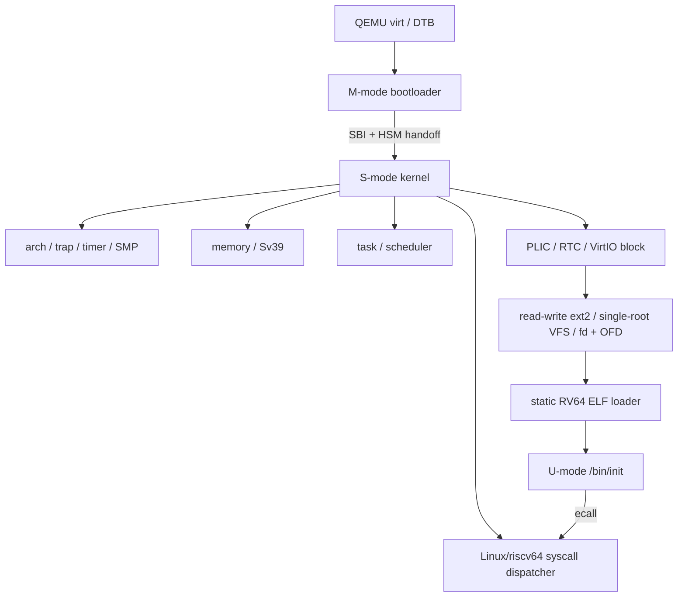

# LiteOS 当前架构

> 更新日期：2026-07-12（Asia/Shanghai）
>
> 目标平台：QEMU `virt`、RV64GC；hart 集合来自 DTB，容量受可用内存和 SBI/PLIC/CLINT 表达能力约束
> 状态边界：本文是当前仓库事实的权威描述；`phase-*.md` 是各阶段当时的审计记录，其“修改前”或“下一阶段”段落不代表当前能力。

## 1. 架构原则

LiteOS 只在能同时证明编号/格式、状态机、所有权、生命周期和并发语义时暴露能力。当前架构遵守：

1. M-mode firmware、S-mode kernel 和 U-mode program 之间只使用明确 ABI。
2. 每个复合状态只有一个权威 owner；runqueue/current/wait membership 不用全局任务表推导。
3. 硬件地址、DMA、trap context 和用户指针不暴露可逃逸的静态可变引用。
4. 不用私有 syscall、错号转发、忽略 flags 或同名 stub 填补标准语义。
5. 当前未形成闭环的功能返回 `-ENOSYS` 或不存在于公共接口中。

## 2. 组件和依赖方向

依赖不反向跨层：driver 不依赖 syscall，task 不依赖 GUI/设备策略，VFS 不保存用户 fd 假象。

## 3. M-mode bootloader

`bootloader/` 基于 RustSBI，它只负责 supervisor execution environment：

- 任意合法 cold-boot hart 使用原子状态竞争全局初始化所有权。
- 清 BSS、解析 DTB、初始化 UART/CLINT/QEMU reset、发布不可变 RustSBI 实例。
- 验证 DTB hart mask；单字 SBI mask 只能表达 `usize::BITS` 个 hart ID，这个 ABI 边界不表示实际核数。
- 每个可表达 hart ID 有独占 M-mode trap stack 和 local HSM state；cold-boot hart 等待全部 DTB local state ready，只启动自己进入 kernel。
- 其他 DTB hart 保持 HSM `STOPPED`，直到 kernel 发起 `hart_start`。
- 实现 RustSBI 对外报告的 SBI 2.0 子集：Base、TIME、IPI、RFENCE、HSM、SRST、DBCN。
- RFENCE 向每个目标 hart 发布请求并同步等待 ack；普通 IPI 只负责唤醒。
- PMP 将 firmware 与 S-mode kernel 范围分开，最终通过 `mret` 进入 S-mode。

它不是通用真实硬件 firmware；CLINT、QEMU reset 和物理地址布局都针对 `virt` machine。

## 4. Kernel 启动与 SMP

kernel 只有一个 `_start`。动态 hart table 尚未发布时，唯一 cold-boot hart 使用 linker early stack；table 发布后，secondary 在无栈汇编阶段按 `a0` hart ID 查找动态 startup stack，再设置 `gp/tp` 并进入 `kmain_secondary`。唯一 boot owner 执行：

1. trap vector 和日志；
2. DTB 发布与 required SBI extension probe；
3. kernel allocator，然后按 DTB mask 构造动态 `HartTopology`；
4. frame allocator 和 kernel Sv39 page table；
5. RTC/monotonic timer；
6. single-root VFS；
7. PLIC 与 VirtIO block discovery；
8. composition root 将 primary block adapter 装配为 ext2 root mount；
9. 动态 `ProcessorTopology`，然后构造 PID 1 `/bin/init` 并入队。

`HartTopology` 持有每个 DTB hart 的 startup stack、softirq pending 和 online/active 状态；task module 的 `ProcessorTopology` 按同一 DTB 集合独立拥有 processor slot，避免 arch 反向依赖 scheduler。boot hart 用同一个 `_start` 地址、DTB 地址作为 opaque，通过 SBI HSM 逐个启动 mask 中的 secondary。`INIT_READY.store(Release)` 一次性发布全局对象；secondary 用 Acquire 消费后激活共享 kernel page table。boot hart 只有在动态 online mask 等于 DTB mask 后才继续；每个 hart 完成同步 RFENCE 后进入 `run_tasks()`。

## 5. Trap 与上下文

- U-mode trap 通过每个地址空间共享的 trampoline 进入，切换 kernel `satp` 和 kernel stack。
- `TrapContext` 保存 32 个 GPR（包括用户 `gp/tp`）、32 个 FP register、`fcsr`、`sepc/sstatus` 和 kernel return metadata。
- 进入 kernel 后恢复 kernel `gp/tp`，返回前恢复用户值，因此 U-mode `tp` 可作为未来 TLS base，但当前未初始化 TLS。
- S-mode trap 不开启 nested interrupt；kernel exception fail-stop，用户 illegal/breakpoint/page fault 只终止当前 task。
- timer hardirq 只发布 per-hart deferred work 并触发 software interrupt；user-return 与 scheduler idle 共用同一 consumer，不在 hardirq 中切换。
- external interrupt 只从当前 hart 的 QEMU S-mode PLIC context `2 * hart + 1` claim/complete。

## 6. 并发与同步

- `LocalIrqGuard` 使用 RAII 保存/恢复本地 SIE，并且不可跨 hart 移动。
- `IrqMutex<T>` 的获取顺序固定为 disable local interrupt -> spin mutex；释放顺序反向，防止同 hart interrupt reentrancy。
- interrupt-safe lock 是非睡眠锁；guard 内不得调度、阻塞 I/O 或等待可睡眠对象。
- per-hart `Processor` 的 current/runqueue/idle context 只由 owner hart 在 SIE 关闭时可变访问。
- scheduler 的 `ProcessorTopology` 与 softirq 的 `HartTopology` 都只为 DTB 中真实存在的 hart 建槽；稀疏 hart ID 不产生占位 processor。
- 远端 task 只通过 inbound mailbox + SBI IPI 发布，不跨 hart 借用其他 scheduler。
- Release/Acquire 只用于初始化、online mask、mailbox 和 RFENCE 等真正发布关系；Relaxed 只用于负载 hint/计数。

## 7. 内存模型

### 7.1 Kernel

- kernel linker 区间按 `.text=RX`、`.rodata=R`、`.data/.bss=RW+NX` 映射。
- kernel 剩余物理内存在 physmap 中 RW+NX 映射。
- 4 MiB buddy allocator 服务 kernel `alloc`；独立 frame allocator 用 `FrameTracker` RAII 拥有物理页。
- 每个 DTB hart 的动态 startup stack 从 kernel allocator 分配；boot hart 在构造 topology 前只使用唯一 linker early stack。
- 新 frame 在交给页表、ELF BSS 或 DMA 前清零。

### 7.2 User

- 每个 Process 拥有独立 Sv39 `MemorySet`，当前 ASID 固定为 0。
- `MemorySet` 的有序 VMA 表唯一拥有 ELF LOAD、`brk` heap、256 KiB RW+NX stack、anonymous private mapping、supervisor-only TrapContext 与 kernel mapping；不存在独立 heap/mmap shadow registry。
- ELF LOAD 权限来自 program header，W+X 直接拒绝。
- user copyin/copyout 在 AddressSpace lock 内逐页验证 `U|R`/`U|W`，只返回 owned bytes，不返回指向用户 frame 的 Rust reference。
- 页表修改用本地 `sfence.vma` + 同步 SBI RFENCE 刷新所有 online hart。
- anonymous private `mmap` eager 分配清零页，`munmap` 拆分区间，`mprotect` 拆分并合并等价 VMA；提交前验证完整区间，映射 OOM 回滚页表和 frame owner。

当前只实现 anonymous private eager mapping，支持 `PROT_NONE`、地址 hint 与 `MAP_FIXED_NOREPLACE`。`PROT_NONE` VMA 继续持有 frame，但 leaf PTE 保持 invalid，`mprotect` 在同一 frame 上发布或撤销 leaf。无 destructive `MAP_FIXED`、file/shared mapping、COW 或 lazy fault。

## 8. Process、Thread 与生命周期

`TaskControlBlock` 显式组合：

- `Process`：Arc-owned TGID、AddressSpace、cwd inode、FileDescriptorTable，由 thread group 共享。相对 pathname 直接从 cwd inode 解析；`getcwd` 从当前 VFS `..`/目录项关系反向生成 raw absolute path，不保留可能随 rename 漂移的 path cache。
- `ThreadContext`：TID、kernel stack、独立 TrapContext VA、kernel `TaskContext`、clear-child-tid 与 robust-list registration。
- `SchedulingEntity`：`RunState`、enqueue generation、唯一 `WaitMembership`、vruntime/nice 和 last-CPU hint。

TaskManager 的单一 process graph 拥有单调 PID/TID 分配、parent edge，以及每个 TGID 的 live thread collection 或最小 exit record。fork-shaped clone 深拷贝 Process；thread-shaped clone 共享 Arc<Process>，使用独立 kernel stack/trap context、用户 stack 与 TLS `tp`。单线程 exit 只回收该 Thread，最后一个 Thread 才提交 process exit record。robust-list cleanup 先执行；process graph 注销 Thread owner 后才发布 clear-child-tid/futex wake，因此 `pthread_join` 返回时 sibling 已不再参与 `thread_count`。

TaskManager 的唯一 indexed wait registry 拥有 wait registration，并可同时索引 `(TGID,uaddr)`、一个 ppoll 的多个 Pipe/Console source 与 absolute deadline。队列锁覆盖 futex 用户值比较、I/O readiness、signal pending 复查与 `WaitMembership` 发布；任一 source wake、EOF/broken endpoint、timeout 和 signal interruption 都原子删除同一 registration 及全部索引。blocking path 在 owner lock 内复查 readiness/deliverable signal，因此不存在 compare/enqueue、close/enqueue、signal/enqueue lost wakeup 或双重消费。

Signal disposition 属于共享 Process；mask、coalesced standard-signal pending bit+首个 siginfo 与至多一条 syscall replay record 属于 Thread。`tgkill` 发布 `SI_TKILL`；最后一个 child Thread 退出发布 `SIGCHLD/CLD_EXITED`，并与 wait4 completion 共用 process graph 的同一退出提交点。`rt_sigtimedwait` 从同一 pending owner 消费指定 set，阻塞时使用 indexed wait registry 和可选 deadline；未屏蔽、非忽略 signal 则取消 deadline/futex/child/console/signal wait 并以 `Interrupted` 结果恢复 task。trap/syscall 边界把可重启结果暂存为 userspace `EINTR`，同时保存原 `a0..a5/a7/ecall PC`；实际交付 handler 含 `SA_RESTART` 时，signal frame 才保存 replay context，否则保存 `EINTR` context。trap return 选择最低未屏蔽 signal，在普通用户栈构造 Linux RV64 `siginfo + ucontext + sigcontext`，保存完整 GPR/FP state，并把 RA 指向独立 U|RX signal-return trampoline。`rt_sigreturn` 恢复原 mask、寄存器、FP 与 PC。当前 blocking `wait4` 和无 timeout 的 futex WAIT 可重启；带 relative timeout 的 futex WAIT 与 `nanosleep` 保持 `EINTR`，避免错误延长 timeout。无 altstack、queued realtime value、process-directed selection 或完整多线程 process 的 SIGCHLD target selection。

`execve` 先完整读取 file、复制 byte argv/envp、构造新 MemorySet/initial stack，然后一次替换 AddressSpace。失败不修改旧映像；成功后 trap 返回点不用旧 syscall result 覆盖新入口。

## 9. 调度模型

- 只有一个 `CfsRunQueue`；无 FIFO/Priority/策略切换双轨。
- Ready entry 携带 generation 和 immutable vruntime snapshot；旧 generation 只能被丢弃，不会重复执行。
- `SchedulingState` 在一个 `IrqMutex` 内统一管理 run state、generation、wait registration ID 和 wake result。
- indexed wait registry 用唯一 ID 拥有 task，deadline 有序索引只消费到期 entry，不扫描 TGID table。
- Blocking -> WakePending -> Ready 协议解决 wake-before-switch；repeated/stale wake 不重复入队。
- idle 在 SIE=0 下完成 deferred work -> drain -> select -> WFI，醒来后才短暂投递 pending trap，消除 interrupt-before-WFI lost wakeup，无工作时不忙轮询。

该调度器只是固定权重的最小公平排序，不声称 Linux CFS 的完整 weight、bandwidth、affinity、RT 或层级语义。当前也没有可用于证明 migration/work stealing 的多 task workload。

## 10. VFS 与文件系统

- `VirtualFileSystem` 只拥有一个 root filesystem；repeated mount 拒绝。
- pathname 是 NUL 之前的 raw bytes，逐 component 查找；`.`/`..` 通过已验证 inode 关系解析并钳制在根目录，不做错误词法化简。
- 不跟随 symlink；遇到 symlink 明确拒绝。
- 唯一根文件系统是同步读写 ext2 revision 1；inode API 统一承载 read/write/truncate、目录枚举与 create/unlink/rename，进程 fd entry 引用共享 offset/status flags 的 OFD。
- ext2 对块号/目录项/间接块做边界验证，I/O 错误不冒充 sparse zero。
- ext2 支持 `filetype`、`sparse_super` 与 `large_file`：分配/释放同步更新位图、group descriptor、primary/backup superblock 和 512-byte `i_blocks`；未知 incompat/RO-compat、journal/recovery 或旧式无 file-type 目录项会拒绝挂载。
- 文件系统只有一个 mutation lock，append、目录变更和 allocator 元数据使用单一串行化顺序；unlink 后仍被 OFD 引用的 inode 延迟到最后 close 回收。
- kernel ELF loader 要求 regular inode、至少一个 execute mode bit 和 full read。

每个 Process 拥有唯一 `FileDescriptorTable`；fd entry 保存 `FD_CLOEXEC`，dup/fork 后共享同一 OFD。最后一个 Thread 提交 process exit 后立即取走并关闭全部 fd，不能把 EOF/SIGPIPE 等语义延迟到 TCB memory reap。PID 1 的 `0/1/2` 指向同一个 Terminal。anonymous Pipe 独占 64 KiB byte ring、read/write endpoint lifecycle 与 4096-byte `PIPE_BUF` 原子写；OFD Drop 发布 EOF/broken readiness，blocking read/write 复用 indexed wait registry，readv scatter 与 writev 不另建数据路径。

ext2 不提供 journal；每次 syscall 返回前相关块请求已经完成，`fsync` 进一步使用设备 FLUSH，但突然断电后的跨块原子恢复仍需 e2fsck，这一点不伪装成 ext3/ext4 语义。

## 11. 设备模型

### 11.1 PLIC

- 唯一 `IrqMutex<PlicInterruptController>`，QEMU S context 映射为 `2 * hart + 1`。
- threshold、enable 与 affinity 只遍历 DTB hart mask；注册 block IRQ 时绑定实际 cold-boot hart。
- handler 顺序是 current-context claim -> device ack -> PLIC complete。

### 11.2 VirtIO block

- legacy MMIO transport，单 split virtqueue；同步 read/write，并在设备声明 `VIRTIO_BLK_F_FLUSH` 时实现 flush。
- queue ring 使用 contiguous `FrameTracker` DMA pages，`Mutex<VirtQueue>` 串行 descriptor/avail/used/free-list。
- descriptor 先于 avail index release 发布，used index 以 acquire 消费。
- used chain/descriptor ID/回收数损坏时 fail-stop，不继续使用被破坏的 free list。
- request 在 device completion 前不返回；无 reset/quiesce 证明时不提供伪 timeout。

### 11.3 RTC

timer 拥有唯一 Goldfish RTC 实例，通过有界 volatile MMIO 读取 real-time base。monotonic time 来自 RISC-V time counter/SBI timer。

### 11.4 UART console

DTB 同时提供 16550 MMIO range 与 PLIC IRQ。kernel identity-map 该 range，UART driver 唯一拥有固定 1024-byte RX ring；hardirq 只 volatile drain RBR、在 ring 满时继续 ack 并丢弃超额输入，然后发布 per-hart console softirq。deferred context 将 raw bytes 送入唯一 Terminal line discipline：支持 ICRNL/IGNCR/INLCR、OPOST/ONLCR、canonical/echo/erase/kill/EOF，以及 VINTR/VQUIT/VSUSP 向 foreground process group 投递 kernel signal。当前不支持完整 VMIN/VTIME、TCSETSW drain、TCSETSF flush、stop/continue scheduler state 或 `/dev/console`/`/dev/tty` inode。

当前不支持 VirtIO modern transport、queue reset、multi-request、non-coherent DMA cache maintenance、IOMMU 或非 QEMU PLIC topology。

## 12. ELF 与最小用户态

- 只接受 ELF64/LE/RISC-V/ET_EXEC，RVC + soft/single/double-float flags。
- 拒绝 PIE/ET_DYN、`PT_DYNAMIC`、`PT_INTERP`、`PT_TLS`、W+X、executable stack、RV32E/quad/TSO/unknown flags。
- program header table 必须完整位于可读 LOAD 中，entry 必须位于用户可执行 leaf。
- initial `sp` 16-byte aligned，布局为 `argc, argv, NULL, envp, NULL, auxv`。
- auxv 只包含 `AT_PHDR/AT_PHENT/AT_PHNUM/AT_PAGESZ/AT_ENTRY/AT_NULL`。
- 自带 `_start` 初始化 `gp`，从栈推导 argc/argv/envp，main 返回后调用 `exit_group`。
- `/bin/init` 是镜像中唯一 user binary；启动时通过标准文件 syscall 验证 create/write/fsync/read/fstat/getdents/truncate/rename/unlink，并在后续冷启动验证持久化，随后持续 yield。

无 `AT_RANDOM`、`AT_HWCAP`、vDSO、program `PT_TLS`、dynamic relocation 或 interpreter。这些缺失使当前系统不能运行常规 musl 程序。

固定 musl v1.2.6 的无 `PT_TLS` 静态 pthread consumer 已作为真实 ABI consumer 启动：musl 从 initial auxv 初始化内建主线程区，使用 `PROT_NONE -> mprotect(RW)` 建立带 guard 的 child stack，以 Linux pthread clone flags 发布 TLS/parent-TID/clear-child-tid，并经 private futex 完成 `pthread_join`、mutex/condition/timedwait，再以 handler + `tgkill` 验证 signal-interrupted futex、`nanosleep` 和 `waitpid`。同一 consumer 验证 `SA_RESTART` 下无 timeout futex 与 `waitpid` 的透明重放，以及 `nanosleep` 继续返回 `EINTR/rem`。这只证明固定 consumer 触发的路径，不改变上述通用边界。

BusyBox 官方 release 1.37.0 已固定 tarball SHA-256、唯一 `init + ash`/基础 applet config 与 inittab。独立 gate 构造单 BusyBox inode/hardlink rootfs，冷启动 init，等待 UART `askfirst`，注入命令并由 ash 输出 `LITEOS_BUSYBOX_SHELL_42`，再用 Ctrl-C 中断 foreground loop 并继续执行。默认 `make build` 尚未切换，且该 tracer bullet 不证明 pipe、stop/continue job control、全部 termios action 或全部 applet。

## 13. Syscall ABI

U-mode 使用 Linux/riscv64 约定：`a7=number`、`a0..a5=args`、`a0=result`、kernel error 为负 errno。共享 crate 只有 55 个已实现的 Linux number，未识别 number 一律 `-ENOSYS`。

完整状态、参数、结构体、errno、POSIX 与 musl 路径见 [syscall 支持矩阵](syscall-support.md)。

## 14. 已删除的功能

下列能力曾以私有 ABI、错号 Linux 入口、不完整 stub 或无调用抽象存在，已整链删除：

- 38 个 LiteOS 私有 syscall number 以及全部错号/错签名入口。
- GUI、framebuffer、VirtIO GPU/input、Web/window manager、字体与用户演示。
- watchdog、power/resource/device registry、系统统计与管理 syscall。
- 私有 thread create/join、fork/wait 草稿、伪 zombie/parent/child 状态。
- 不完整 signal frame/kill/rt_sigreturn 与 futex 草稿。
- pipe/FIFO、shared-memory handle、Unix-domain socket、private poll 和各自等待队列。
- 旧的不可达 fd table 与 read/close/lseek/dup/fcntl 表面实现；当前实现是重新建立的单一 fd/OFD 路径。
- FAT32、ext2 write/allocation/xattr/transaction/cache 伪能力。
- dynamic-loader syscall、PIE/TLS 草稿和错误 mmap/munmap 近似实现。
- PCI/platform/power/resource 抽象、VirtIO console/network/GPU/input 驱动与 block write/async façade。
- user shell、commands、GUI/Web、tests、自定义 user allocator 与测试工具。

删除表示当前不支持，不表示该标准能力永久禁止。未来只能从正确 Linux/riscv64 ABI 和唯一内部模型重新实现。

## 15. 明确不支持

- 完整 Linux/POSIX conformance 或完整 musl runtime。
- vfork、完整 clone flags、跨 sibling 的 exit_group/exec 事务。
- signal altstack/queue/process-directed delivery、其他 syscall 的 restart coverage、带 relative timeout futex 的剩余时间重启、futex PI/requeue/bitset 与完整 pthread primitive。
- socket、epoll 与通用设备 fd/ioctl/mmap UAPI。
- journal、突然断电后的跨块原子恢复、symlink resolution、mount namespace。
- file/shared mapping、COW、lazy paging 与 destructive `MAP_FIXED`。
- PIE、dynamic linker、script interpreter、relocation、TLS、vDSO。
- entropy/CRNG、`getrandom`、`AT_RANDOM`。
- network/GPU/input user device ABI，以及 TTY device-node、完整 VMIN/VTIME 与 stop/continue 语义。
- 真实硬件、非一致 DMA、IOMMU、VirtIO modern/packed ring、非 QEMU PLIC topology。

## 16. 后续路线

路线按可验证竖切排序，不同时铺开多个半实现子系统：

1. **BusyBox shell tracer bullet**：固定上游 release、静态配置与 ELF gate，从真实 `init + ash` 的首个缺失 Linux ABI 开始逐项打通；不 patch BusyBox/musl，不保留自带 shell 双轨。
2. **pipe/TTY/job-control 竖切**：以 ash 的实际调用链实现 fd-backed pipe、console TTY 与 process-group/signal 语义，覆盖重定向、后台任务和 Ctrl-C。
3. **动态装载与设备扩展**：只在静态 shell 闭环后分别设计 `PT_TLS/ET_DYN/PT_INTERP` 和标准 fd/ioctl/mmap/poll UAPI，不与当前静态路径并行维护半实现。

## 17. 验证方法

仓库规则禁止维护、修正或执行测试用例。当前采用：

- 单一 `make verify` 入口执行 workspace 与 bootloader/kernel/user 构建以及 Clippy `-D warnings`；
- Rust AST 围栏检查正向 module 依赖、facade seam、scoped interface、ABI、owner 与 unsafe proof；
- `git diff --check` 和 rustfmt 定向检查；
- ELF header/program header/symbol/反汇编静态检查；
- ext2 inode mode/content 检查；
- 使用 QEMU `virt -smp 1/3/8` 冷启动 gate，强制检查动态 hart count/mask、`online == possible`、`LiteOS init` 与 `ext2 rw ok`。
- 固定 BusyBox 1.37.0 官方 tarball/config/inittab/musl sysroot，检查 ELF 后构造 hardlink rootfs，并以 UART 输入驱动 `init + ash` 输出不可由输入原文伪造的成功标记。

此类观察只证明已走过的路径，不代替并发、损坏镜像、OOM 或真实硬件的形式证明。
