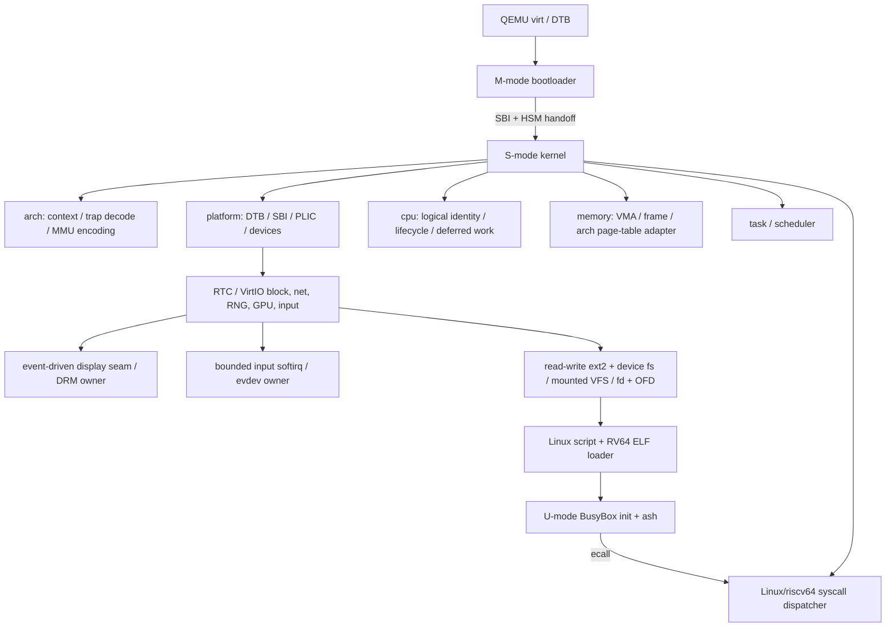

# LiteOS 当前架构

> 更新日期：2026-07-18（Asia/Shanghai）
>
> 当前 backend：QEMU `virt` + RV64GC；generic kernel 只消费 `arch`/`platform` 的静态语义 façade，不依赖 RISC-V crate、CSR、Sv39 或 SBI
> 状态边界：本文是当前仓库事实的权威描述；`phase-*.md` 是各阶段当时的审计记录，其“修改前”或“下一阶段”段落不代表当前能力。

## 领域索引

| 领域 | 权威文件 | 覆盖范围 |
|---|---|---|
| Display / input / terminal | [architecture/display-terminal.md](architecture/display-terminal.md) | VirtIO-GPU、DRM/KMS、kobject hotplug、evdev、PTY、Rust terminal、字体与 resize reactor |
| 其余当前事实 | 本文件对应编号章节 | boot、memory、task、VFS、network、ABI 与 userspace；迁移时必须从本文件删除原文，禁止双份事实 |

## 1. 架构原则

LiteOS 只在能同时证明编号/格式、状态机、所有权、生命周期和并发语义时暴露能力。当前架构遵守：

1. M-mode firmware、S-mode kernel 和 U-mode program 之间只使用明确 ABI。
2. 每个复合状态只有一个权威 owner；runqueue/current/wait membership 不用全局任务表推导。
3. 硬件地址、DMA、trap context 和用户指针不暴露可逃逸的静态可变引用。
4. 不用私有 syscall、错号转发、忽略 flags 或同名 stub 填补标准语义。
5. 当前未形成闭环的功能返回 `-ENOSYS` 或不存在于公共接口中。

## 2. 组件和依赖方向

`main.rs` 只装配这些 seam。`arch` 选择由编译期 `cfg(target_arch)` 完成，没有 `Architecture` trait、动态分派或并存实现；`platform` 只组合当前 machine 的 firmware、DTB、PLIC 与设备策略。依赖不反向跨层：driver 不依赖 syscall，task 不依赖 GUI/设备策略，VFS 不保存用户 fd 假象。

## 3. M-mode bootloader

`bootloader/` 基于 RustSBI，它只负责 supervisor execution environment：

- 任意合法 cold-boot CPU 使用原子状态竞争全局初始化所有权。
- 清 BSS、解析 DTB、初始化 UART/CLINT/QEMU reset、发布不可变 RustSBI 实例。
- 验证 platform CPU set；单字 SBI mask 只能表达 `usize::BITS` 个 hart ID，这个 ABI 边界不表示实际核数。
- 每个可表达 hart ID 有独占 M-mode trap stack 和 local HSM state；cold-boot CPU 等待全部 DTB local state ready，只启动自己进入 kernel。
- 其他 DTB hart 保持 HSM `STOPPED`，直到 kernel 发起 `hart_start`。
- 实现 RustSBI 对外报告的 SBI 2.0 子集：Base、TIME、IPI、RFENCE、HSM、SRST、DBCN。
- RFENCE 向每个目标 CPU 发布请求并同步等待 ack；普通 IPI 只负责唤醒。
- PMP 将 firmware 与 S-mode kernel 范围分开，最终通过 `mret` 进入 S-mode。

它不是通用真实硬件 firmware；CLINT、QEMU reset 和物理地址布局都针对 `virt` machine。

## 4. Kernel 启动与 SMP

kernel 只有一个 architecture-owned `_start`。startup table 尚未发布时，唯一 cold-boot CPU 使用 linker early stack；table 发布后，secondary 在无栈汇编阶段按 firmware hardware identity 查找动态 startup stack 与 logical `CpuId`，再设置架构本地 execution state。raw boot/trap callback ABI 集中在 `entry` seam；boot registers 被封装成 `BootContext { HardwareCpuId, BootInfo }` 后才进入 generic `kernel_main`。唯一 boot owner 执行：

1. trap vector 和日志；
2. DTB 发布与 required SBI extension probe；
3. kernel allocator、platform facts，然后按 enabled CPU nodes 构造 `cpu::CpuTopology`；
4. frame allocator 和 kernel Sv39 page table；
5. RTC/monotonic timer；
6. root namespace VFS；
7. PLIC 与 modern-only VirtIO block、RNG、GPU、network、input discovery；
8. composition root 将 primary display seam 与统一 Pipe notification 装配为 DRM owner，将 input adapters 装配为 evdev owners，将 primary block adapter 装配为 ext2 root，再把 devfs、devpts、procfs 与只读 CPU-topology sysfs adapter 分别挂载到 `/dev`、`/dev/pts`、`/proc`、`/sys`；
9. 按 logical `CpuId` 构造动态 `ProcessorTopology`，然后构造 PID 1 `/bin/init` 并入队。

`cpu::CpuTopology` 是 hardware identity → logical `CpuId`、possible/online/active lifecycle 的唯一 owner；hardware identity 不作为数组下标或领域 mask。architecture startup table 只拥有 entry 前所需的 stack 与 hardware/logical projection；`cpu::deferred`、`timer`、`task::memory_barrier` 和 `ProcessorTopology` 分别拥有自己的 per-CPU 复合状态，不存在跨领域的 CPU 状态聚合。timer 沿上一 deadline 的固定相位推进并跳过错过周期。boot CPU 通过 platform 的 typed HSM operation 启动 secondary；`INIT_READY.store(Release)` 一次发布全局对象，secondary 以 Acquire 消费并激活共享 kernel page table。boot CPU 只在 logical online set 等于 possible set 后继续；每个 CPU 完成同步 remote TLB fence 后进入 `run_tasks()`。

logger 在唯一 IRQ-safe owner 内同时维护 level/filter、严格递增 sequence 与固定 128-entry、每条最多 192-byte 的 record ring；启用的 record 先提交环，再同步投影到 SBI UART，日志路径不分配。devfs 发布 Linux `/dev/kmsg` 1:11；每个只读 OFD 独占 cursor，从打开时仍保留的最老 record 开始，按 Linux `priority,sequence,timestamp,flags;message` 形状一次读取一条。当前范围只支持 nonblocking boot snapshot：空、覆盖与小 buffer 分别为 `EAGAIN/EPIPE/EINVAL`，write、seek、blocking wait 与 poll wake 尚未开放。

## 5. Trap 与上下文

- U-mode trap 通过每个地址空间共享的 architecture trampoline 进入，切换 kernel address-space token 和 kernel stack。
- architecture `UserContext` 保存用户执行上下文及 kernel return metadata；task 只调用 syscall、signal、TLS、返回值和 PC 等语义方法，不访问寄存器布局。
- 进入 kernel 后恢复 kernel `gp/tp`，返回前恢复用户值，因此 U-mode `tp` 可作为未来 TLS base，但当前未初始化 TLS。
- S-mode trap 不开启 nested interrupt；kernel exception fail-stop，用户 illegal/breakpoint/page fault 只终止当前 task。
- architecture trap backend 把原始 cause/CSR 解码成 `TrapEvent`；generic trap domain 只处理 syscall、timer、software、external、page fault 等语义事件。timer hardirq 只发布 per-CPU deferred work并触发 software interrupt；user-return 与 scheduler idle 共用同一 consumer，不在 hardirq 中切换。deferred timer 仅在当前 CPU 确有 queued/inbound 竞争者时请求抢占，单一 Running task 不做空转 context switch。到期 wait 在一次 registry lock 内摘取固定 32-entry 栈上 batch、锁外 wake；ITIMER_REAL 与 POSIX wall-clock timers 共用 TaskManager 唯一有序 deadline index，摘取同样大小的栈上 batch、沿原始相位重装，锁外向 Process 或精确 Thread 发布 SIGALRM/SI_TIMER，空 queue 不扫描 process graph 或分配内存。两者的 backlog 通过同一独立合并 softirq 立即续批，既不无界占用 deferred context，也不延迟到下一 hardware tick。全局 load average 只由到期 timer claimant 每 5 秒采样 runnable Thread；普通 tick 只做 atomic deadline read，不获取全局 IRQ-safe value lock，procfs/sysinfo 只读取最近 committed sample。
- external interrupt 只经 platform façade claim/dispatch/complete；QEMU PLIC context 计算不泄漏到 generic trap 或 driver。

## 6. 并发与同步

- `LocalIrqGuard` 使用 RAII 保存/恢复 architecture local-interrupt state，并且不可跨 CPU 移动。
- `IrqMutex<T>` 的获取顺序固定为 disable local interrupt -> spin mutex；释放顺序反向，防止同 CPU interrupt reentrancy。
- interrupt-safe lock 是非睡眠锁；guard 内不得调度、阻塞 I/O 或等待可睡眠对象。
- per-CPU `Processor` 的 current/runqueue/idle context 只由 owner CPU 在 local interrupt 关闭时可变访问。
- scheduler、deferred work、timer 与 memory-barrier state 都只按 `cpu::count()` 建槽并以 `CpuId::index()` 定位；稀疏 hardware identity 不产生占位 slot。
- `HardwareCpuId` 只穿过 arch/platform firmware seam；system、scheduler、affinity、procfs 与 syscall 共用 logical `CpuId/CpuSet`，不得直接暴露 hardware identity。
- 远端 task 只通过 logical target 的 inbound mailbox + platform IPI 发布，不跨 CPU 借用其他 scheduler。
- 同步 userspace memory barrier 向 frozen active `CpuSet` 发布单调 generation、经 platform 合并发送 IPI，并等待每个 CPU 在 full fence 后确认；并发 syscall caller 在 local interrupt 关闭期间主动消费自己的 pending request，避免互等 IPI trap。
- Release/Acquire 只用于初始化、online mask、mailbox 和 RFENCE 等真正发布关系；Relaxed 只用于负载 hint/计数。

## 7. 内存模型

### 7.1 Kernel

- kernel linker 区间按 `.text=RX`、`.rodata=R`、`.data/.bss=RW+NX` 映射。
- kernel 剩余物理内存在 physmap 中 RW+NX 映射。
- 2 MiB bootstrap bump arena 只打破启动期循环依赖，早期对象可跨切换存活但该静态 linker 区间不进入 frame allocator。frame allocator 发布后，global heap 唯一使用 frame-backed slab/direct 实现：8–1024 byte canonical class 由单页 slab 承载，non-full slab 以每-class intrusive 双链 O(1) 插入/删除，free-chain 在候选 `FrameTracker` 独占期锁外构造；更大或高对齐对象独占 order-aligned direct extent。slab 最后一个 backend block 与 direct object 释放时先撤销 heap publication，再在 heap lock/IRQ-off 外重建唯一 `FrameTracker`，所以所有动态 heap 页都可确定返还，不存在跨 extent 合并或永久高水位。物理 allocator 继续以一字节每页 block-state、per-order intrusive 双链、nonempty bitmap 与同锁计数维护唯一 buddy metadata：order 选择 O(1)，split/merge 最多跨 `usize::BITS` 层。`FrameAllocationClass` 将形状与 progress policy 分离：用户 residency/page-table 使用 `Reclaimable` 并保留一个最小 heap-growth extent；heap slab/direct 使用 `KernelHeap` 进入该水位但仍保留 16 个最终 cleanup frame；只有启动期 DMA 使用 `KernelCritical` 越过最终水位。topology 发布后，每个 logical CPU 另有 8–256 byte cache：本地 pop/push 只短暂关闭 IRQ、不取 global lock，miss 在一次 slab lock 内最多补充 8 block，每 class 最多保留 32 block，cross-CPU free 迁移到 executing CPU；这部分 retention 有固定 topology×class 上限。用户可达的 page-table owner、page-cache、exec/fork/vfork/thread control block 分配使用 fallible reserve/`Arc::try_new`，并在 PTE、trap page 或 global registry 发布前完成 owner storage；wait/process/timer/page-cache/epoll/socket/ext2/IRQ 的 runtime ordered publication 共用唯一 `FallibleMap` AVL node transaction，OOM 返回既有 `ENOMEM`/进程失败语义，不遗留已映射或已发布但无索引的 owner。proc snapshot、argument/comm copy、fd/OFD metadata 与 VirtIO descriptor staging 同样在 publication 前显式 reserve，不依赖全局 alloc-error。
- 每个 platform CPU 的动态 startup stack 从 kernel allocator 分配；boot CPU 在构造 topology 前只使用唯一 linker early stack。
- 新 frame 在交给页表、ELF BSS 或 DMA 前清零。
- memory 只向 `arch::mmu` 提交 READ/WRITE/EXECUTE/USER/GLOBAL 语义权限与 frame-owner adapter；RISC-V backend 私下完成 Sv39 walk、PTE `V/R/W/X/U/G/A/D` 编码、canonical address、address-space token 与 local fence。generic memory 不依赖这些 bit 的数值布局。

### 7.2 User

- 每个 Process 拥有独立 Sv39 `MemorySet`，当前 ASID 固定为 0。
- `MemorySet` 唯一拥有精确 program break 与有序 VMA 表；`brk` 页只表示为普通 anonymous VMA，因此 `MAP_FIXED` 可与 Linux 一样替换其中任意页，不能把 heap 元数据塞进不可拆分的特殊 VMA。VMA 表同时拥有 ELF LOAD、默认 8 MiB soft-limit 的 RW+NX grow-down stack、anonymous/file private mapping、anonymous/file shared mapping、supervisor-only TrapContext 与 kernel mapping，不存在独立 heap/mmap shadow registry。`MAP_NORESERVE` 在 syscall ABI seam 被接受，但当前没有 swap/commit reservation owner，不能为它复制无效的 per-VMA 状态；所有 mapping 的实际 residency 仍只由既有 lazy-fault 路径决定。
- ELF LOAD 权限来自 program header，W+X 直接拒绝。
- user copyin/copyout 在 AddressSpace lock 内先完成整段 fault-in 与 `U|R`/`U|W` 验证，再执行逐页复制；因此后段 fault 不会留下部分 kernel write。prepare 已在逐页 fault loop 内提交权限证明，不再额外遍历整段页表做重复 validation；接口只返回 owned bytes，不返回指向用户 frame 的 Rust reference。
- 页表修改用本地 `sfence.vma` + 同步 SBI RFENCE 刷新所有 online hart。
- ELF、anonymous private/shared、`brk`、stack 与 file mapping 都只提交 VMA，物理页在首次合法 fault 时驻留；anonymous shared backing 以唯一 Arc 和 page index 跨 fork 保持 frame identity，private resident fork 后继续 COW。`brk` 伸缩只增删 program-break 尾部的 anonymous VMA，精确 byte break 独立于页对齐 VMA 边界且随 fork 复制。stack fault 同时受当前 `RLIMIT_STACK/RLIMIT_AS` 与 guard gap 约束。

procfs 动态快照经 `Inode::is_volatile` 在 `RegularFile` façade 内直接读取且不可 mmap，避免 `/proc/stat`、进程统计与 I/O counter 固化为首次读取值；持久文件仍由 page cache 唯一拥有 resident page。

regular-file page cache 是 shared mapping 与文件 I/O 的唯一页 owner；ordinary read cache hit 只读 page index，miss fill 与 write/append/truncate/writeback 共用 per-file operation domain，保证 storage read 到 cache publication 之间没有 mutation 穿过。mmap fault 包括 cache hit 都在同一 operation domain 内先验证稳定 EOF，且 EOF 判定位于 node/frame allocation 前；返回的 page Arc 是 fault-before-truncate 的瞬时线性化凭据，MAP_PRIVATE 在取得它后才分配私有 frame。miss frame 在 publication 前由 storage 直接填充，ext2 完整对齐块同样直接进入 caller buffer，不分配中间页/块 `Vec` 或执行冗余 memcpy。syscall regular I/O 每次调用只解析一次 `RegularFile` facade 并跨 user-copy chunks 复用，ELF source 在其完整解析生命周期复用同一 facade；二者都不按 chunk/probe 重复读取 inode identity、获取全局 cache lock。vector I/O 的连续 iovec metadata 以 PAGE_SIZE staging 批量导入；scalar/vector/positioned regular I/O 同样共用一个 PAGE_SIZE data staging buffer，使 ABI metadata、page-cache frame、user-copy fault/copy 与 syscall chunk 粒度一致。`sendfile` 的 regular→regular 路径复用同一 facade，以一个 PAGE_SIZE kernel staging 完成文件间传输；两个 OFD offset 按 identity 排序后整次持有，输出 write-sequence 覆盖完整 operation，因此不经过 userspace bounce、不形成反向 offset 锁序或跨 writer chunk 穿插。完整 write 另持不参与 page fault 的 per-file write-sequence gate，跨 OFD writer 不会在 user-copy chunks 间穿插。chunk commit 再短暂取得 operation lock，因此同文件 mmap user buffer 的 miss fault 不会递归自锁。storage write 只获取一次 page-index lock，并以 `FallibleMap` ordered range 只更新写区间内实际 resident page，不扫描 cache hole。一次 writeback 只读取一次稳定 EOF，按固定 32 resident-page batch 锁外写 dirty pages，并复用一个 PAGE_SIZE stack scratch；其 heap 消耗不再随 mapping 页数放大。CachedPage 用单一 atomic state 同时发布 dirty bit 与 writable-PTE 引用数，writeback 只在零 writer 的同一次 CAS 中清 dirty，避免并发 writable mapping 丢脏。OOM registry 使用注册时复用 tombstone 的 stable weak slots 和同锁轮转 cursor；每轮最多访问 64 个 owner，`ReclaimRequest` 再以目标页数和 resident-entry scan budget 约束 adapter，callback 在 registry 锁外执行。page cache 与 MemorySet 各自从持久 page/VPN cursor 继续，脏页/不可回收前缀不会在每次 OOM 从头重扫；page-cache adapter 同时 try-lock write-sequence/operation 后，可把零 writer、无外部引用的 dirty 页组成固定 32 页事务，filesystem mutation owner 忙时立即放弃，只有 storage commit 成功才清 dirty 并删除 cache owner。private COW frame 即使仍被其他 mm 引用，只要撤销本 mm PTE 就会触发全局 TLB flush，不再以实际 frame 释放数错误替代 translation 变化。private file/ELF VMA 只保存随机读 fault source。每个 private resident record 原子拥有 frame、MADV_FREE discardable 与 MAP_PRIVATE dirty 状态，不再用三棵树人工同步同一 residency。MAP_PRIVATE 文件页首次写 fault 是唯一 dirty 转换点，因此 clean 页可重建回收，dirty 页保持到 DONTNEED/munmap/exit；`MADV_FREE` anonymous 页只在后续 write 前保持可丢弃。统一 frame 慢路径同步回收这些页及无外部引用的 clean cache page，并对满足上述条件的 shared dirty 页先提交再回收，绝不静默丢弃 private/shared dirty 数据；回收后仍无法满足 user page fault 时以 SIGKILL 终止 faulting process group，kernel 与其他进程继续运行。truncate 撤销 EOF 外 shared PTE，private 后续 fault 同样交付 SIGBUS。当前不提供 swap、全局 OOM victim ranking、tmpfs/shmem pathname object或后台 writeback/reclaim worker。

dirty page 数只由 `CachedPage` 状态转换投影；达到物理页容量四分之一后，新的 shared writable mapping 按每 64 页一次的固定 cadence 在发布 PTE 前请求前台回收。单一跨 CPU gate 合并同一高水位尝试，保证 ext2 journal staging 仍有确定余量，并避免多个 CPU 重复扫描 owner 或提交 FLUSH；它不建立后台 worker，也不成为第二份 page 状态。

## 8. Process、Thread 与生命周期

`TaskControlBlock` 显式组合：

- `Process`：Arc-owned TGID、可替换 AddressSpace handle、cwd、fd table、credentials、resource limits 与聚合 CPU runtime，由 thread group 共享。supplementary groups 使用 immutable `Option<Arc<Vec<u32>>>`，pathname permission snapshot 与 fork 只复制 Arc，`setgroups` 是唯一 fallible 替换点。fork 复制 limit 值但 CPU 计时从零开始，exec 保留 limits。
- `ThreadContext`：TID、kernel stack、独立 TrapContext VA、kernel `TaskContext`、clear-child-tid、robust-list 与 alternate signal stack registration。
- `SchedulingEntity`：`RunState`、enqueue generation、唯一 `WaitMembership`、vruntime/nice 和 last-CPU hint。

TaskManager 的单一 process graph 拥有受 Linux 30-bit futex owner mask 约束的单调 PID/TID 分配、parent edge，以及每个 TGID 的 live thread collection、唯一 group-exit status 或最小 exit record。fork-shaped clone 深拷贝 Process；thread-shaped clone 共享 Arc<Process>，使用独立 kernel stack/trap context、用户 stack 与 TLS `tp`。标准 `CLONE_VM|CLONE_VFORK|SIGCHLD` child 拥有独立 Process，却与 parent 精确共享同一 AddressSpace Arc，并在共享 mm 中按全局 TID 分配 supervisor-only trap page；只有 child exec 构造并切换到全新 AddressSpace 或 exit 删除临时 trap page后，process graph 才恢复发起 vfork 的那一个 parent Thread。其他 parent sibling 可继续运行并并发发起自己的 spawn。`exit` 只回收 calling Thread；首个 `exit_group` 或默认致命 signal 固定 parent-visible status，并用不可屏蔽 signal 解除 sibling wait、请求远端 CPU 调度。orphan/session exit consequences 在 graph lock 内只标记 per-process transient effect bits，锁外按稳定 cursor 分两阶段零分配发布 SIGHUP、SIGCONT，不构造随 process 数增长的 target snapshot。每个 Thread 都在自己的内核栈完成退出，最后一个 Thread 才发布 zombie、精确 wait status 与 SIGCHLD。non-PI robust-list cleanup 在 exit 与 exec 替换旧 AddressSpace 前执行：一次快照旧 mm 与 fault limits，OWNER_DIED CAS 冲突用返回的 live word 重查 owner TID 并持续重试，成功后仅在被替换值含 WAITERS 时 wake；`list_op_pending` 的 zero-owner 窗口直接补 wake，且已在主链的 pending node 只处理一次。process graph 注销 Thread owner 后才发布 clear-child-tid/futex wake，因此 `pthread_join` 返回时 sibling 已不再参与 `thread_count`。user trap return 在 noreturn trampoline 前显式释放当前 TCB Arc；terminal exit 则分成可返回的 prepare 与 raw-context switch：prepare 正常展开全部 Rust frame并把唯一保活 owner 移交 per-CPU deferred-reap slot，随后 idle stack 析构 TCB，避免 kernel stack 与其栈上 `Arc<TaskControlBlock>` 形成自引用环。

每个 parent Process 可同时登记多个按 TID 唯一的 child-event waiter。exit/stop/continue event 在 process graph 锁内先授予一个 claimant；status copyout 成功后才由该 token 唯一消费，copyout 失败则释放 claim 并唤醒其他 waiter 重新检查。一个 zombie 因此不能被两个 parent Thread 重复观察或回收，不同 child 仍可并行等待。

TaskManager 的唯一 indexed wait registry 拥有 wait registration，并可同时索引 memory-domain futex key、一个 ppoll 的多个 Pipe/Console source 与 absolute deadline。MemorySet 把 private futex 归一化为 AddressSpace identity + uaddr，把 anonymous/file shared futex 归一化为 backing/file identity + byte offset；queue 不读取 VMA。entry 与全部 index node 在 SchedulingState 发布 Blocking 前完成 fallible prepare，owner lock 与 scheduling lock 内只做零分配 commit，OOM 因而不会留下不可唤醒的 Thread。队列锁覆盖 key/value 解析、bitset compare、requeue、I/O readiness、signal pending 复查与 `WaitMembership` 发布；requeue 只迁移同一 registration 的 key，保留 wait ID、deadline 与 bitset。socket adapter 的内部 edge notification 固定以 source-native `POLLIN` 注册，不继承调用者请求的 `POLLOUT` 等 mask；registry lock 内先排空合并 token，再用真实 socket state 做 level recheck，因此旧 token 不会压制 TCP connect 等后续 edge。任一 source wake、EOF/broken endpoint、timeout 和 signal interruption都原子删除同一 registration 及全部索引，因此不存在 compare/enqueue、close/enqueue、signal/enqueue lost wakeup 或双重消费。

NetworkStack 在每次 smoltcp poll 前原地冻结 endpoint readiness，poll 后只把 false→true 转换记录为 owner-local pending bit，再按稳定 ID cursor 在 stack lock 外通知；AF_PACKET 的 receive queue empty→readable 与 device TX pool full→writable 也进入同一 pending-edge drain。该路径不分配随 socket 数增长的临时集合，也不会把长期 writable/readable 重复发布为新 edge，因此并发网络 I/O 不产生 softirq wake storm；blocking poll 仍在 registry lock 内排空 token并做真实 level recheck，保证 edge 合并不丢 readiness。

Signal disposition 与 coalesced process-directed pending bit+首个 siginfo 由共享 Process 的同一 `ProcessSignalState` lock 拥有；mask、thread-directed pending、alternate stack registration 与至多一条 syscall replay record属于 Thread。altstack active 状态只由当前用户 SP 与 registration range 推导：普通 `CLONE_VM` Thread 清空，fork/vfork 继承，exec 清空；`SA_ONSTACK` frame 做 RISC-V 16-byte 对齐与 nested overflow 检查，`SS_AUTODISARM` 在 frame 成功发布后清空并由 `rt_sigreturn` 的 `ucontext.uc_stack` 恢复。`tgkill` 发布 SI_TKILL 到 Thread；`kill` 按标准 selector 发布 SI_USER，并在 process graph 内执行 credentials permission，SIGCONT 保留 same-session 例外；kernel-generated signal 明确绕过该检查。TTY group signal 与 SIGCHLD 复用同一路径。其余 stop/continue、global init、wait interruption、delivery 与 signal frame 语义不变。当前 blocking `wait4` 和无 timeout futex WAIT 可重启；relative-timeout wait 保持 `EINTR`。无 queued realtime value。

`execve` 通过 inode-backed `ExecutableSource` 只读取 ELF metadata 与 PT_INTERP，PT_LOAD 以 immutable random-read source 发布；entry、PHDR 与 initial-stack 实际触及页在事务内 fault，其余页按需 fault，BSS 保持零填充。新映像同时受 `RLIMIT_STACK/AS/DATA` 约束；任一失败丢弃整个新 AddressSpace，成功后才替换 Process handle。

## 9. 调度模型

- 只有一个 `CfsRunQueue`；无 FIFO/Priority/策略切换双轨。
- Ready entry 携带 generation 和 immutable vruntime snapshot；旧 generation 只能被丢弃，不会重复执行。
- 每个 live Thread 都拥有固定 kernel stack，因此 topology 用物理页容量/kernel-stack 页数证明 runnable membership 上界，并在启动时为每 CPU local heap 与 inbound mailbox 一次预留；local enqueue 只在 capacity pressure 时全量清理 stale generation、平时只清连续 stale root，remote delivery 只在 mailbox 满时清理，mailbox drain 每轮持锁对 snapshot 做一次全量 validation，并仅在 surviving batch 越过 local backing 时 compact heap；所有路径保留 backing capacity，wake/IRQ 路径不分配。
- `SchedulingState` 在一个 `IrqMutex` 内统一管理 run state、generation、wait registration ID 和 wake result。
- indexed wait registry 用唯一 ID 拥有 task，deadline 有序索引只消费到期 entry，不扫描 TGID table；每批单锁摘取、锁外唤醒，registry entry 与 SchedulingState membership 不一致时 fail-stop。
- console、poll、signal、deadline、futex、pipe、file-lock、child 与 vfork 共用唯一 `PreparedBlock` seam：它接管外部 owner guard，在 scheduling lock 内原子绑定 waiter membership 与 Blocking state，并在 token 返回前释放 owner；token 只消费一次完成 context switch 与 wake result 获取。
- Blocking -> WakePending -> Ready 协议解决 wake-before-switch；repeated/stale wake 不重复入队。
- idle 在 SIE=0 下完成 deferred work -> drain -> select，确认无任务后释放唯一 local-IRQ guard，以 SIE=1 执行 WFI；device IRQ 因而能直接唤醒空闲 vCPU。enable→WFI 窗口若先投递 trap，周期 timer 最迟在下一 tick 结束 WFI，下一轮仍先在 SIE=0 下重查 softirq/mailbox/runqueue，不会丢失 runnable state或忙轮询。

该调度器以 Linux v7.1 的 40 档 nice reciprocal 权重执行最小公平排序，但不声称 Linux CFS 的 bandwidth、RT、层级或完整 EEVDF 语义。vruntime 使用 Q10 微秒；runtime commit 将 Linux 预计算的 `2^32/weight` 拆成高位整块与低 12-bit 余数，只用乘法/移位推进，因此 1µs 高权重增量也不会被舍入成零成本。`Sched` policy lock 唯一拥有 nice、当前 `SCHED_OTHER` 与 `SCHED_RESET_ON_FORK`；active slice 同锁冻结 dispatch 时的 nice index，使远端 setpriority 只影响下一 slice，不追溯重算已消耗时间。get/setpriority 的 PROCESS/PGRP/USER collection、credentials、RLIMIT_NICE 与 Linux 部分成功语义封闭在 TaskManager nice seam，Running target 在修改后收到 reschedule。legacy policy/param syscall 共用相邻 policy seam 完成全局 TID、priority、credentials 与 flag transition，fork/clone 在唯一 `forked` 路径消费 reset flag，exec 保留。`sched_rr_get_interval` 对 live TID 返回 timer owner 从实际 tick/timebase 换算的固定 `SCHED_OTHER` 基础 quantum；它不冒充 Linux EEVDF 的动态 entity slice 或空闲 runqueue 零 interval。FIFO/RR/BATCH/IDLE/DEADLINE/EXT class 仍未实现。`SchedulingState` 与 run state 同锁拥有强类型 per-Thread `CpuAffinity`，bit 只表示有序 platform topology 的 logical CPU index；fork/clone 继承、exec 保留。`sched_setaffinity` 将变长 userspace mask 与 active topology 相交，Ready task 通过 generation 换代废弃旧 entry，Running/切出中的 task 收到 reschedule，并让 syscall caller 以正常 CFS membership 轮转等待到源 CPU ownership 释放；因此成功返回时 target 不再在禁止 CPU 执行。new placement、wake、preempt 与 SIGCONT 全部复用同一 affinity-aware `select_cpu`；候选扫描直接索引同序 ProcessorTopology，本地与远端 runqueue 都直接使用 logical `CpuId`；只有 platform IPI 才转换 hardware identity。当前 topology 启动后不可热插拔，也没有 cpuset/cgroup restriction。每个 CPU 发布 local Ready heap 的最小 vruntime，new Process/Thread placement 再与 inbound snapshot 合并并钳制到该 floor；因此 fork churn 不能用 parent 的旧 vruntime 插队到既有 runnable task 前，没有竞争者时也不产生固定启动债务。该原子值只是公平性 hint，不拥有 membership。Ready state publication 同锁产生并消费线性 token，把每个 CPU 的 logical Ready 数精确投影到 `ready_entries`；它覆盖 local 与 inbound location，physical generation tombstone 不参与选核或 timer 抢占。local enqueue 在有 spare capacity 时只做 O(log N) heap push，并只清连续 stale root；remote delivery 普通路径只做 O(1) deque push，mailbox snapshot 在 drain 时线性验证一次；full retain 仅由预留容量压力触发。因此 N 个全新 Ready task 不再额外获取 `N(N-1)/2` 次 scheduling lock，单一 Running task也不会因非 root stale token 每 tick 自我切换。timer tick 对 active slice 做 checkpoint，一次同步推进 Thread/Process/CPU runtime 与 vruntime，但不结束 dispatch；block/preempt/vfork/exit 只提交 checkpoint 后的剩余增量，因此持续运行的单任务无需 context switch 也能准确发布 `/proc/stat`，且没有第二份 runtime owner。Process 聚合 counter 保留 exited Thread 的已提交时间。wait precheck 的 ready/timeout/signal early return 不推进计时，避免下一次真实 commit 重复累计同一增量。CPU clock 与 same-thread-group procfs 查询只读投影 calling Thread checkpoint 后的 active delta，不改变累计 owner 或 vruntime；其他 CPU 上 running sibling 的 pending delta 最迟在下一 scheduler tick 提交，与 Linux thread-group CPU time 的 bounded-stale 取样一致。Ready delivery 在目标 CPU 已有 running task 时同步发布 reschedule，同 CPU 在 trap return 抢占，远端与 mailbox 共用一次 platform IPI，避免 syscall 密集型 writer 饿死已唤醒 reader。signal publication 未唤醒 waiter 时显式请求 Running target 调度，因此单任务 idle tick、console 或 network softirq 不再制造无意义的自我切换，也不延迟远端 signal delivery。idle stack 的 local IRQ guard 跨 `__switch` 保活，确保 task kernel continuation 固定以 `SIE=0` 恢复；用户态中断仍由 `sret/SPIE` 开启，因而非睡眠 guard 不会被 timer 抢占并遗留。抢占先进入不可调度的 `Preempting`，group stop 使用 `StopPending -> Stopped`，两者都只在源 CPU 切回 idle stack后提交。Stopped Thread 保留被 stop 时的 runnable/blocked 恢复语义；wait completion 可把 stopped-blocked 转为 stopped-runnable，SIGCONT 再唯一入队。远端 stop 通过 per-CPU reschedule flag + platform IPI 投递，不跨 CPU 访问 local runqueue。8-CPU BusyBox gate 用累计 per-CPU runtime 验证全部 platform CPU 被使用。

## 10. VFS 与文件系统

- `VirtualFileSystem` 拥有唯一 persistent root 和 boot-time mount table；repeated root/mountpoint 发布拒绝。
- pathname 是 NUL 之前的 raw bytes，逐 component 查找；`.`/`..` 通过已验证 inode 关系与 mount enter/leave 解析并钳制在根目录，不做错误词法化简。
- pathname resolver 统一跟随中间与默认末项 symlink，relative target 从 link parent 继续、absolute target 从 root 重启，最多跟随 40 次；`readlinkat`/`AT_SYMLINK_NOFOLLOW` 复用同一 resolver，仅保留最终 link inode。
- persistent root 是带内置 JBD2 journal inode 的读写 ext2 revision 1；boot layout 提供 `01777 /tmp`、`0700 /root` 与标准 root/nobody passwd/group records；内存 device filesystem 挂载到预建的 `/dev` mountpoint，提供 `null/zero/random/urandom/tty/console` 与指向 procfs 的 `fd/stdin/stdout/stderr` symlink，两个 entropy 节点和 `getrandom` 复用唯一 VirtIO RNG owner且不做弱随机回退；只读 procfs 挂载到预建的 `/proc`，按 Linux 格式投影系统节点、动态 `/proc/self`、live `/proc/<pid>/{stat,status,statm,comm,cmdline,task}`、`/proc/<pid>/task/<tid>/{stat,status,statm,comm,cmdline}` 以及 magic-link fd directory，其中 `/proc/stat` 的 `btime` 来自 timer 唯一拥有的 boot epoch。`/proc/buddyinfo` 直接投影 frame allocator 的 per-order free-block 同锁计数，`/proc/vmstat` 的 `allocstall/pgscan_direct/pgsteal_direct` 直接投影 reclaimer registry 的 attempt/scan/reclaimed 累计值，读取均不扫描 allocator/reclaimer 集合或建立 shadow counter。`statm` 的 size/resident/shared/data 来自 MemorySet 同一次 VMA/residency 扫描，text 来自 exec transaction 提交的主 ELF code range，因而不把 interpreter 或 JIT executable VMA 误计入；lib/dt 固定为 Linux 保留的零。thread directory 从 process graph 的 live membership 动态投影，各线程 stat 使用 ThreadContext/SchedulingEntity 的 TID、创建时刻、状态、nice、runtime 与 last CPU。当前没有独立 thread-name mutation owner，thread `comm` 与所属 Process 共享。`cmdline` 从 MemorySet 唯一拥有的 argument range 读取实时 NUL 分隔 argv，不复制静态参数；fd target 从 OFD/VFS opened entry 或 anonymous object identity 实时投影。其余 procfs 与 `sysinfo` 共用 task façade 的一次采集边界，只投影 process、frame、fd table、credentials、scheduler、timer 与 per-CPU runtime 的唯一 owner 状态；mounts 则直接投影 VFS 唯一 mount table。VFS opened-entry chain 唯一维护 parent/name/deleted，cwd、directory fd 与 pathname-backed OFD 共用该 identity，rename/hardlink/unlink 后不缓存或猜测绝对路径。
- ext2 对块号/目录项/间接块做边界验证，I/O 错误不冒充 sparse zero。
- ext2 支持 `has_journal`、`filetype`、`sparse_super` 与 `large_file`：分配/释放同步更新位图、group descriptor、primary/backup superblock 和 512-byte `i_blocks`；journal 只接受固定 JBD2 v2、4 KiB、32-bit block tag 且无 checksum/revoke/async/fast-commit 扩展，其他未知 compat/incompat/RO-compat 或旧式无 file-type 目录项拒绝挂载。
- page-cache writeback 以固定 32 resident-page batch 只 clone dirty Arc，并复用一个 PAGE_SIZE stack scratch；同一 batch 经 `StorageWriter` 进入一个 ext2 `MutationGuard`，data/allocation metadata 共用 redo set，inode size/mtime/ctime 只在 batch 尾更新一次。journal 从已验证 block/tag layout 缓存 exact unique-home-block capacity；既有 staged block 原地覆盖，容量不足在 commit 前返回 `NoSpace`，page cache 二分重试并且只清理成功 committed prefix。因此正常 32 dirty-page batch 从 32 次同步 JBD2 commit、129 次总 FLUSH 降为一次 commit、5 次总 FLUSH，不按 range 分配内存，也不在失败时丢 dirty suffix。
- procfs 还投影 Process `/io` 与每个 Thread `/task/<tid>/io`：分层 I/O counter 分别保存 live thread 与包含已退出 worker 的 thread-group 全生命周期；`read_bytes` 只在 regular cache miss 实际读取 storage 时推进，`write_bytes` 只计同步 storage 已提交前缀。`statm.shared` 包含共享映射与仍干净的 file/ELF private resident page，写脏 COW 页归入 private。`meminfo` 的 Cached/Dirty/MemAvailable 从 page-cache owner 读取 resident/dirty/可直接回收页，Slab 从 heap owner 的 live slab/direct page 常数时间 projection 读取；尚无 owner 的 LRU/anon 分类保持零。`buddyinfo/vmstat` 提供不会在读取路径放大锁或扫描的碎片与 direct-reclaim 证据。预建 `/sys` 挂载只读 sysfs，按 immutable DTB 紧凑 logical index 提供 `/sys/devices/system/cpu/{possible,present,online,cpuN/online}`；LiteOS 不支持 CPU hotplug，进入 userspace 的 boot 已使全部 possible hart online。
- ext2 `statfs` 与 allocator mutation 共锁，按 Linux ext2 规则从总块数扣除 superblock/GDT/bitmap/inode-table overhead，并从可用块扣除 reserved blocks；devfs、procfs、sysfs 与 anonymous pipe 使用零容量的 Linux simple-statfs 形状，不伪造可分配空间。
- 文件系统只有一个 mutation lock，append、目录变更、link count、allocator、journal write-set 与 orphan chain 使用单一串行化顺序。ext2 link-count policy 唯一拥有 32,000 上限和 checked increment/decrement；mkdir/rmdir 的 parent count、hardlink target increment 与 directory rename parent net delta 都在第一次 namespace edit 前计算，跨父移动以及同父目录替换只在现有 transaction 中对每个 parent 赋值一次，分别以 `EMLINK`/invalid-filesystem 拒绝上溢/下溢。transaction 的 write-set 使用 `FallibleMap`；`MutationGuard` 在发布 active journal 前冻结 filesystem-topology-sized group/superblock rollback，并以四个固定 stack slot 在 live inode 首次可变访问前捕获一次 preimage，新分配与 final-Drop inode 只使用单一 transient slot 登记 abort cache removal。四个 slot 精确对应当前最宽 rename 的 old/new parent、moved/replacement inode；重复修改最多比较四次且不分配，因此正常 transaction 的 inode rollback 时间/内存从 O(all cached inodes) 降为对 cache working set 严格 O(1)，不建 generation、dirty flag、bitmap 或第二 owner。unlink/rename 在 undo Arc 保活 inode 前冻结真实 external ownership，rollback implementation 不会被误当 OFD 而多走 orphan transaction。commit/checkpoint 复用固定 buffer且不 clone/collect transaction 内容；同一 home block 在 active transaction 内更新时直接复用既有 Vec/node。chmod/chown 把 immutable caller identity 与语义请求交给 VFS permission evaluator，并在 ext2 mutation lock 内对同一 live inode type/mode/UID/GID 完成授权与 set-ID 归一化；拒绝在 rollback snapshot/journal 之前返回，成功则保持 mutation lock 直到 metadata commit，因此 concurrent owner change 不能穿过检查。regular read 按 Linux relatime 仅在 atime 不晚于 mtime/ctime 或已满一天时开启 metadata transaction，不为每个 page-cache miss 重写 inode。每次 mutation 先把完整 redo set 写入 journal、FLUSH、写 commit block、FLUSH，再 checkpoint 到 home blocks；启动在一致性扫描前重放已提交事务。unlink 后仍被 OFD 引用的 inode原子加入 `s_last_orphan` 链，最后 close 摘链回收；掉电遗留 orphan 在 mount 时回收。
- kernel ELF loader 要求 regular inode 与至少一个 execute mode bit；filesystem 只通过 `ExecutableSource::read_exact_at` adapter 暴露只读随机访问，不向 memory 泄漏 inode，也不保留完整 ELF 文件副本。

每个 Process 拥有唯一 `FileDescriptorTable`；独立 `fs::file::descriptor_table` 深 module 封闭 slot、`FD_CLOEXEC`、dup/fork OFD sharing、publication、free-slot search 与 procfs snapshot，private `IndexedSlots` 则作为 slot vector 与 index 的唯一复合 owner，使 occupancy 不能绕过索引转换。fd slot 与 OFD control block 在 publication 前 fallible reserve，value constructor 仅在 limit 与 backing reserve 成功后执行；旧 fd 不存在、达到 fd limit、allocator OOM 分别稳定映射 `EBADF`、`EMFILE`、`ENOMEM`。同一 files lock 内的四层 free-slot hierarchy 以 level-0 empty bit、逐层 nonempty-word summary 和只证明 occupied prefix 的保守 cursor 返回 `>= minimum` 的最低空闲 fd；1,048,576 上限严格只需四层，最坏查询只读七个 bitmap word、执行四次 `trailing_zeros`，dense 顺序 open 只做 prefix/length check，open/pipe/socketpair/dup/F_DUPFD 不再扫描 entry vector。满表 index 的 16,645 个逻辑 word、四个 Vec header 与 prefix 共 133,264 bytes（allocator capacity 可向上取整）。index 不穿过 module seam，entry/index capacity 均按摊销增长，growth OOM 不改变逻辑 slots，close/dup3/CLOEXEC/fork/exit 与 entries 同事务更新，dup3 替换 occupied target 也必须验证旧 index bit。close、dup3 replacement 与 exec CLOEXEC 在 files lock 内只 detach entry，最后 descriptor 的 epoll/flock cleanup 及 Process record-lock consequence 均在锁外完成；CLOEXEC 另以 transient forward cursor 和固定 32-entry stack batch 令完整 slot scan 保持 O(FDSize)。最后一个 Thread 提交 process exit 后立即取走并关闭全部 fd，不能把 EOF/SIGPIPE 等语义延迟到 TCB memory reap；exit/close 不得隐式调用全局 `sync`，持久化只由 journal/writeback 与显式 `fsync/fdatasync/sync` 契约负责。PID 1 的 `0/1/2` 指向同一个 Terminal。anonymous Pipe、AF_UNIX stream transport 与 PTY output 各自使用 64 KiB byte ring；每次 ring I/O 只形成尾部和可选头部两段连续 slice copy，随后一次提交 head/length，不执行逐字节取模或状态更新。anonymous Pipe 由同一 owner 维护 read/write endpoint lifecycle 与 4096-byte `PIPE_BUF` 原子写，blocking writer registration 保存本次原子写所需完整容量，通用 poll readiness 仍只表示存在可写空间，二者由同一 Pipe state snapshot 判定。内核 readiness notification 在构造时只分配一字节 backing，但继续复用同一 Pipe lifecycle、generation 与 notifier owner；token occupancy 只在零和一之间合并，不建立第二条 wait path或保存 runtime mode flag。eventfd 的 64-bit counter 与 semaphore mode 由 `ipc::EventFd` 单锁拥有，read/write readiness 通过两条独立的一字节 notification Pipe 接入同一 poll/epoll wait seam。AF_UNIX stream 按 Linux stream 语义在存在任意容量时允许非零短写，不继承 anonymous pipe 的 `PIPE_BUF` 原子性。UnixSocket 必须先取得 endpoint Arc 并释放 socket state lock，再执行 Pipe I/O、endpoint Drop 或 readiness notification，避免与 indexed wait registry 的 readiness 复查形成反向锁序。OFD Drop 发布 EOF/broken readiness，blocking read/write 复用 indexed wait registry。scalar 与 vector sequential I/O 共用唯一 descriptor dispatch：scalar 作为单元素 vector 进入，read/write 只在 user ABI wrapper 处不同；regular 与 positioned I/O 继续复用同一 chunk/user-copy engine，ordinary 路径整次只持有一次共享 OFD offset lock。所有 vector I/O 一次导入 iovec，non-regular sequential 路径由唯一 cursor 维护跨 vector copy progress。socket scalar/vector write 都向 backend 提交完整 iterator 语义：datagram 始终形成一个消息，不再按 4096 bytes 静默截断；stream 使用 bounded reusable staging 并返回真实 short/partial count。eventfd read 同样不分 scalar/vector：总 capacity 至少一个 u64，实际只 scatter 一个 u64；writev 保持 scalar-write fallback 的逐 iovec 语义。readv scatter、writev gather 与 positioned I/O 不另建持久数据 owner。

`syscall::user_iovec` 现在是所有 vector syscall 的唯一 raw RV64 layout/page-batched importer；fs 独立应用 SSIZE_MAX，socket syscall wrapper 先按 Linux `MAX_RW_COUNT` 投影有效 prefix，再由 façade 应用 atomic protocol limit。唯一 `UserIoCursor` 同时服务 sequential 与 message I/O：stream sendmsg/sendto 以固定 64 KiB heap buffer 只读 stage，再仅按 backend 实际 short count 推进，因此未发送 suffix 不丢不重；recvmsg/recvfrom 同样只分配 protocol 最大有用 capacity。datagram/raw 在 gather 前完成大小 preflight，仍只向 backend 提交一个完整消息；stream total 不再错误继承 65,535-byte datagram ceiling。

epoll evaluation 对顶层及 nested epoll 都先捕获 ctl/close notification read generation，再把 change source 与全部 OFD source 直接追加到一个 transient key builder；builder 只转移一份 key Vec 与一份 snapshot-guard Vec，后者统一保存 epoll generation 和 connected AF_UNIX datagram peer identity，不为每个 interest 建临时 collection。poll、epoll 与 direct blocking 在 keys/guards 完成后共用唯一递归 adapter-preparation seam，并在进入 registry lock 前传播 nested snapshot OOM；console adapter 错误 policy 由显式 enum 保留既有 poll/direct-ignore 与 epoll-`EIO` 差异。wait-registry lock 内只排空 change token、比较 generation/peer identity 并扫描 level readiness，不复制 snapshot、Arc 或 keys。change source 使用不分组的普通 registration，一次 ctl/close 先摘除全部已发布 stale waiter membership；普通 data source 仍按顶层 epoll instance 分组做 wake-one。持久 snapshot mismatch 继续拒绝尚未发布的并发旧 snapshot，即使 token 已被另一 waiter 消费、新 source 尚未 ready 也强制重建 source-key set，因此 epoll ADD/MOD/DEL/final-close 与 datagram peer replacement 都不会让 waiter 睡在旧 registration 上，OOM 也不会被折成 not-ready。LT/ET/ONESHOT、revision 与 delivery cursor 仍由 `fs::Epoll` 唯一拥有。

`fsync/sync` 使用 VirtIO FLUSH；metadata mutation 返回前已完成 journal commit 与 home checkpoint。掉电门在并行 `mkdir/cp/ln/mv/rm` 和 open-unlink lifecycle 中直接 SIGKILL QEMU，随后由同一 journal replay/orphan recovery 冷启动，并以只读 e2fsck 验证 inode、目录、link count、bitmap 与 group summary。该保证不外推到数据块 checksum、外部 journal、JBD2 可选扩展或硬件未兑现 FLUSH 的场景。

## 11. 设备模型

### 11.1 PLIC

- 唯一 `IrqMutex<PlicInterruptController>`，QEMU S context 映射为 `2 * hart + 1`。
- threshold、enable 与 affinity 只遍历 platform CPU set；注册 block IRQ 时绑定实际 cold-boot CPU。
- handler 顺序是 current-context claim -> device ack -> PLIC complete。

### 11.2 VirtIO transport 与 block

- transport 只接受 MMIO v2 与 `VIRTIO_F_VERSION_1`；feature selector、三段 64-bit queue address、`QueueReady` 和 config-generation 读取均按 modern 语义，QEMU 启动显式关闭 legacy。
- block 使用单 split virtqueue；同步 read/write，并在设备声明 `VIRTIO_BLK_F_FLUSH` 时实现 flush。
- queue ring 使用 contiguous `FrameTracker` DMA pages，`Mutex<VirtQueue>` 串行 descriptor/avail/used/free-list。
- descriptor 先于 avail index release 发布；queue notify 再以 RISC-V `fence w,o` 保证
  shared-memory index 先于 MMIO doorbell 可见；used index 以 acquire 消费。
- used chain/descriptor ID/回收数损坏时 fail-stop，不继续使用被破坏的 free list。
- request 在 device completion 前不返回；无 reset/quiesce 证明时不提供伪 timeout。

### 11.3 VirtIO network

- modern MMIO v2 transport 使用独立 RX/TX split virtqueue；hardirq 只确认 device status 并发布 network softirq。
- init 一次预分配固定 RX/TX DMA slots 及 descriptor-head 到 slot 的 O(1) index；runtime submission/reap 不分配，RX repost 每轮只 notify 一次。
- 不可复制的 TX reservation 覆盖 smoltcp token 填充窗口；Drop 只归还 Reserved slot，已发布 slot 只能由 used-ring completion 归还，不再引用 caller 临时 frame。
- deferred context 每轮最多消费 64 个 RX frame 和 64 个 TX completion，budget 用尽后用合并 softirq 续批；TX 路径不忙等 device completion。

### 11.4 VirtIO GPU 与 DRM owner

本领域的当前实现事实已迁移到 [Display、input 与 terminal 当前架构](architecture/display-terminal.md)。本节只保留导航；VirtIO-GPU/DRM、SG backing、DIRTYFB、kobject hotplug 的细节不得在此复制。

### 11.5 VirtIO input 与 evdev

详见 [Display、input 与 terminal 当前架构](architecture/display-terminal.md) 第 2 节。

### 11.6 Unix98 PTY 与显示终端

详见 [Display、input 与 terminal 当前架构](architecture/display-terminal.md) 第 2–3 节。

### 11.7 RTC

timer 拥有唯一 Goldfish RTC 实例，通过有界 volatile MMIO 读取 real-time base。monotonic time 来自 RISC-V time counter/SBI timer；`clock_getres` 直接从同一 DTB timebase frequency 推导 wall-clock 粒度，CPU-clock 粒度来自 scheduler 微秒记账，不维护第二份 resolution 状态。scheduler 基础 quantum 与 `sched_rr_get_interval` 共用 timer 校准的 tick interval，不在 syscall 或 task 中复制频率常量。`nanosleep/clock_nanosleep` 在 ABI 层将 relative timestamp 归一化为 absolute monotonic deadline；absolute realtime 经 timer owner 的 immutable boot offset 精确换域，不用两次时钟采样估算。随后 deadline 进入唯一 indexed wait seam；signal 只取消一次 membership，remaining 只由 relative ABI 路径 copyout。

### 11.8 UART console

DTB 同时提供 16550 MMIO range 与 PLIC IRQ。kernel identity-map 该 range，UART driver 唯一拥有固定 1024-byte RX ring；hardirq 只 volatile drain RBR、在 ring 满时继续 ack 并丢弃超额输入，然后发布 per-CPU console softirq。deferred context 将 raw bytes 送入唯一 Terminal line discipline：支持 ICRNL/IGNCR/INLCR、OPOST/ONLCR、canonical/echo/erase/kill/EOF，以及 VINTR/VQUIT/VSUSP 向 foreground process group 投递 kernel signal。noncanonical read 完整区分四种 VMIN/VTIME 组合：poll、首字节 timeout、最小字节 blocking 与首字节后 inter-byte timeout；absolute deadline 复用统一 wait registry，O_NONBLOCK 与 partial/signal completion 不建立第二轨。`/dev/console` 与 caller session 的 `/dev/tty` 重新打开后仍指向同一 Terminal owner；musl `ttyname()` 经 `/proc/self/fd` magic link 与 devfs metadata 得到真实设备名，BusyBox `tty` 不使用 kernel 旁路。后台 `/dev/tty` read 产生 SIGTTIN，`TOSTOP` 下的 write 与 TTY state change 产生 SIGTTOU，blocked/ignored 与 orphan group 遵循 Linux EIO/allow 规则。controlling session leader 退出时原 foreground group 收到 SIGHUP，Terminal 原子解除旧 session，随后可由 init respawn 的新 session leader 重新取得。当前不支持 TCSETSW drain、TCSETSF flush 或 TIOCNOTTY。

当前不支持 VirtIO queue reset、packed ring、block multi-request、non-coherent DMA cache maintenance、IOMMU 或非 QEMU PLIC topology。

## 12. ELF 与 BusyBox userspace

- 接受 ELF64/LE/RISC-V 静态 ET_EXEC，或带唯一绝对 PT_INTERP 的动态 PIE；主程序与 musl interpreter 复用同一映射器。
- 接受 Linux `#!` script：只读取 256-byte binfmt probe，按 space/tab 拆分 interpreter 与至多一个整段 optional argument，替换 argv[0]、插入当前 script pathname，并允许最多 5 次 interpreter rewrite；最终仍只进入同一 ELF loader。
- `PT_DYNAMIC/PT_TLS` 交由 musl 消费；拒绝 W+X、executable stack、RV32E/quad/TSO/unknown flags。
- program header table 必须完整位于可读 LOAD 中，entry 必须位于用户可执行 leaf。
- initial `sp` 16-byte aligned，布局为 `argc, argv, NULL, envp, NULL, auxv`；`AT_EXECFN` 独立指向用户原始 exec pathname，不错误复用可被 script rewrite 的 argv[0]。
- auxv 包含 `AT_PHDR/AT_PHENT/AT_PHNUM/AT_PAGESZ/AT_BASE/AT_ENTRY/AT_RANDOM/AT_EXECFN/AT_NULL`；随机字节只来自 virtio-rng。
- musl `crt1` 初始化 `gp`，从 Linux initial stack 解码 argc/argv/envp/auxv，最终经 `exit_group` 结束 process。
- rootfs 只有一个 BusyBox ELF inode；`/bin/init`、`/bin/sh` 与选定基础 applet 全部是指向它的 hardlink。`/etc/inittab` 只监督 `/bin/console-session`、network service 与 UART recovery ash。console-session 在单一进程内拥有 DRM、evdev、PTY、ANSI model 与 renderer，应用只消费标准 terminal Interface。完整 userspace 由本地 RSA256 签名的 `liteos-base` APK 唯一拥有，最终 `/lib/apk/db/installed` 只能由 guest 内真实 `apk.static --initdb add` 生成；host builder 不伪造 package database，也不保留未登记的第二套 runtime。ABI/shebang consumer 只在 disposable gate 镜像注入，禁止进入产品基线。
- rootfs 另有一个动态 musl PIE `liteos-stress` inode，并仅通过 `cputest`、`memtest`、`cachetest` 三个 hardlink 暴露有界诊断入口：分别覆盖 pthread/多 hart 计算、anonymous fault + fork/COW，以及不显式 sync 的 shared dirty page-cache + 匿名回收压力。它们复用产品 runtime，不引入第二 init、runtime 或测试框架。
- `console-session` 单线程 reactor 在没有 render/resize/blink deadline 时无限阻塞；退出时关闭 PTY master、终止并 reap shell，由 init 重建完整 session。`make run-gui` 默认显示 3008×1692 guest mode 的窗口化 Cocoa Display（`zoom-to-fit=off`），关闭 QEMU monitor，并把 UART 保留到 `target/run-gui-serial.log`；`make run` 仍是显式 UART 开发入口。`run/run-gui/run-gdb` 共用显式 512 MiB 客体内存基线，kernel 仍只消费 DTB 报告的动态物理内存范围。network service 的 stdout/stderr 截断写入 `/run/network-service.log`，后台 lease/renew 日志不与交互命令行竞争 UART。

动态 BusyBox 通过 musl interpreter 完成 relocation、TLS 与 RELRO；独立共享对象 probe 覆盖 `dlopen/dlsym/dlclose`、file-private mmap、destructive `MAP_FIXED` 和 getrandom。当前仍无 `AT_HWCAP`、vDSO 与 swap。

固定 musl v1.2.6 的无 `PT_TLS` 静态 pthread consumer 已作为真实 ABI consumer 启动：musl 从 initial auxv 初始化内建主线程区，使用 `PROT_NONE -> mprotect(RW)` 建立带 guard 的 child stack，以 Linux pthread clone flags 发布 TLS/parent-TID/clear-child-tid，并经 private futex 完成 `pthread_join`、mutex/condition/timedwait，再以 handler + `tgkill` 验证 signal-interrupted futex、`nanosleep` 和 `waitpid`。同一 consumer 验证 `SA_RESTART` 下无 timeout futex 与 `waitpid` 的透明重放、`nanosleep` 继续返回 `EINTR/rem`，并在 child 已从新 exec 映像通过 pipe 同步后验证 parent `setpgid` 的 `EACCES`。这只证明固定 consumer 触发的路径，不改变上述通用边界。

BusyBox 官方 release 1.37.0 已固定 tarball SHA-256、唯一 `init + ash`/基础 applet config 与 inittab。默认 `make build` 先构造单 BusyBox inode/hardlink tree，再将它连同固定 musl/OpenSSL/apk-tools 制作成 signed `liteos-base` package；官方 `ca-certificates-bundle` APK 唯一拥有系统 CA 文件。guest 安装成功后才原子发布可复现基准 `target/rootfs.img`；`fs.img` 是唯一可写开发实例，缺失时由 `make run/run-gdb` 初始化，已存在时不按 mtime 与基准同步，只有 `make reset-rootfs` 明确替换。验证门只消费基准并创建私有可写副本，禁止改写开发实例。host bootstrap 与 guest `/etc/apk/repositories` 共用唯一 Alpine mirror policy，当前固定为华为云镜像的 `v3.22/main`，package SHA-256 与 Alpine repository key 仍是内容真实性边界，不把镜像站当作规范制定者。APK gate 在同一次 bootstrap boot 内验证 dependency failure rollback、add/del、upgrade、RSA tamper rejection 与 `LOCK_NB` 并发写者互斥；独立 disposable image 在 package mutation loop 中掉电，再安装更高版本验证 journal replay 后 database/filesystem 可继续提交。仓库不再存在 Rust init/runtime、host 解包 runtime 或伪 installed-db 路径。BusyBox init 通过三个固定 `respawn` entry 分别监督 `console-session`、network service 与 UART recovery ash；console 也不等待 DHCP；lease script 原子替换 resolv.conf，并在 deconfig/renew 清理旧 route/DNS 状态。选中 applet 还包括 `halt/poweroff/reboot` 与 `ifconfig/route/nc/netstat/udhcpc/ping/wget`；BusyBox 1.37.0 没有 `shutdown` applet，因此 `/bin/shutdown` 是只接受 `now` 的薄 policy script，将 `-h/-H/-P/-r` 分别委托给这些上游 applet，明确拒绝未实现的用户态定时关机。普通 reboot/poweroff 保留 BusyBox init 的 TERM、sync、KILL 与固定 grace period；开发期明确需要跳过 init 清理时可使用上游 `reboot -f`。QEMU user-net 下 `udhcpc` 经标准 AF_PACKET 与 socket option 获取 lease，`ping` 经 effective-root raw ICMP socket 完成 Echo，固定动态 musl probe 与 `wget` 分别验证 DNS、HTTP 和由 OpenSSL 3.5 LTS + Mozilla CA bundle 校验证书/主机名的 HTTPS client。TLS 仍完全位于 userspace，复用唯一 TCP/DNS 路径；错误主机名在受控 gate 中必须失败。`nc -u` 通过 `recvmsg/MSG_PEEK/IP_PKTINFO` 完成双向 UDP，`nc` 的 active connect 与 passive listen/accept 完成双向 TCP stream。工具箱还包含外部 `test`/`[`/`[[`、`stat/mktemp/install/printenv/whoami/groups/yes/tty`、多算法 checksum、`pidof/pgrep/pkill/killall/timeout/nohup/watch`、`vi/less/more`、`diff/patch/cmp`、`hexdump/hd/od/strings`、`tar/unzip`、gzip/bzip2、XZ 解压与 `du/xargs/env/which/readlink/realpath`。Phase 55/56/57 使用 guest self-checking scripts 自行判定 procfs、signal、并发临时文件、staged install、metadata、checksum 与 opened-file identity 语义；各自 disposable image 由 BusyBox init 以唯一 `sysinit` action 直接执行脚本，不经过 askfirst shell/UART 注入，host 只负责隔离镜像、冷启动、deadline、kernel error 和最终成功 marker。既有 gate 还验证 editor/pager termios 恢复、tar path traversal、ash 算术、pipeline、重定向、后台 wait、可执行 script、process-group kill、`ps/free/uptime/top/df/uname/arch/date` 系统可观测性、动态 exec 内存回收、跨冷启动持久化、foreground Ctrl-Z/jobs/bg/fg/Ctrl-C，以及后台 TTY stop/continue 链。BusyBox 上游 `xz` 仅提供解压；当前不证明未选中 applet。

`make verify-apk-apps` 从 `target/rootfs.img` 基准派生 disposable 应用镜像，并由 guest 内真实 `apk.static --no-network` 安装固定 SHA-256 的 curl 8.14.1、SQLite 3.49.2 与 Git 2.49.1 依赖闭包。curl gate 验证默认拒绝 hostname mismatch、注入测试 CA 后接受正确 hostname、redirect、128 KiB 内容校验、四路并发与 timeout；SQLite gate 验证 rollback journal、WAL、两个 writer 的阻塞 record lock、guest reboot 持久化，以及 WAL mutation 中直接 SIGKILL QEMU 后的 journal replay/integrity；Git gate 验证本地 init/add/commit/branch/merge/tag/status 与默认 TLS 下 dumb-HTTP clone/fetch。应用脚本在 guest 内 fail-fast，host 只装配一次性 init、HTTPS fixture、QEMU deadline/掉电和最终 marker；安装镜像与运行结果均以所有执行脚本、kernel/bootloader/rootfs、固定 APK 及 QEMU identity 的内容指纹缓存。这三条竖切不改变开发镜像，也不外推为对应上游全部功能或任意 Alpine package 兼容。

## 13. Syscall ABI

U-mode 使用 Linux/riscv64 约定：`a7=number`、`a0..a5=args`、`a0=result`、kernel error 为负 errno。共享 crate 只有 140 个已接入的 Linux number，未识别 number 一律安静地返回 `-ENOSYS`；用户可控的正常 capability/io_uring probe 不写 kernel log。

完整状态、参数、结构体、errno、POSIX 与 musl 路径见 [syscall 支持矩阵](syscall-support.md)。

## 14. 已删除的功能

下列能力曾以私有 ABI、错号 Linux 入口、不完整 stub 或无调用抽象存在，已整链删除：

- 38 个 LiteOS 私有 syscall number 以及全部错号/错签名入口。
- 旧私有 GUI/framebuffer、VirtIO GPU/input UAPI、kernel font/Web/window manager 与用户演示；当前显示与输入只发布标准 DRM/evdev/netlink ABI，字体只作为用户态 terminal 的构建资产，不保留私有入口。
- watchdog、私有 power/resource/device registry 与管理 syscall。
- 私有 thread create/join、fork/wait 草稿、伪 zombie/parent/child 状态。
- 不完整 signal frame/kill/rt_sigreturn 与 futex 草稿。
- FIFO、shared-memory handle、pathname Unix-domain socket、private poll 和旁路等待队列。
- 旧的不可达 fd table 与 read/close/lseek/dup/fcntl 表面实现；当前实现是重新建立的单一 fd/OFD 路径。
- FAT32、ext2 write/allocation/xattr/transaction/cache 伪能力。
- dynamic-loader syscall、PIE/TLS 草稿和错误 mmap/munmap 近似实现。
- PCI/platform/power/resource 抽象、旧 VirtIO console/GPU/input 驱动与 block async façade。
- user shell、commands、GUI/Web、tests、自定义 user allocator 与测试工具。

删除表示当前不支持，不表示该标准能力永久禁止。未来只能从正确 Linux/riscv64 ABI 和唯一内部模型重新实现。

## 15. 明确不支持

- 完整 Linux/POSIX conformance 或完整 musl runtime。
- clone namespace/pidfd flags、多线程 vfork/fork 与跨 sibling 的 exec 事务。
- queued realtime signal、Linux capabilities/ACL/LSM/user namespace、其他 syscall 的 restart coverage、带 relative timeout futex 的剩余时间重启、futex PI/PI-requeue/WAKE_OP 与完整 pthread primitive。
- 可变 hostname/domainname、UTS namespace、settimeofday 与 kernel timezone mutation。
- 已声明 DRM/evdev scope 之外的通用设备 fd/ioctl/mmap UAPI。
- 外部 journal、JBD2 checksum/64-bit/revoke/async/fast-commit 扩展与 mount namespace。
- tmpfs/shmem pathname object 与后台 writeback/reclaim worker。
- vDSO 与 `AT_HWCAP`。
- IPv6、非 ICMP raw IP protocol、Ethernet ARP packet protocol、多 NIC/network namespace、TCP keepalive/linger policy，以及 DRM atomic KMS/vblank-wait/auth/lease 与 evdev output/revoke/mask/multitouch-slot/hotplug 语义。
- 真实硬件、非一致 DMA、IOMMU、VirtIO packed ring、非 QEMU PLIC topology。

## 16. 后续路线

路线按可验证竖切排序，不同时铺开多个半实现子系统：

1. **共享映射竖切**：Phase 45 已完成 regular-file MAP_SHARED、page-cache coherence、共享 dirty/writeback 与 fault lifecycle。
2. **事件与本地 I/O**：Phase 46–48 已在统一 OFD/readiness/wait seam 上完成 abstract AF_UNIX stream/datagram、epoll 核心语义与 `EPOLLEXCLUSIVE` source wake-one。
3. **网络 I/O**：Phase 49 完成 VirtIO-net、Ethernet/ARP/IPv4 control 与 AF_INET UDP；Phase 50 在同一 NetworkStack/Socket/OFD seam 上完成 TCP active/passive stream、backlog、readiness、shutdown 与 close-time FIN/TIME_WAIT lifecycle；Phase 51 以 AF_PACKET/SOCK_DGRAM、真实 reuse/broadcast/device-binding option 支撑 BusyBox DHCP，并经 musl resolver 与 BusyBox HTTP client 完成 userspace 竖切；Phase 52 在同一 NetworkStack 开放 effective-root AF_INET/SOCK_RAW/IPPROTO_ICMP，并以 OpenSSL LTS 完成证书验证 HTTPS。其他 raw IP protocol 与 ARP packet protocol 仍须单独按 Linux 权限和 packet 语义开放。
4. **图形 console 竖切**：[Phase 60](phase-60-console-session.md) 已把 DRM、evdev、PTY、ANSI model 与 renderer 收敛进唯一 `console-session`。下一条竖切优先补齐标准 terminal protocol 与真实 TUI workload；只有测量证明软件 dirty renderer 成为瓶颈时才引入内部 GPU Adapter，禁止恢复多进程桌面或私有应用 ABI。

## 17. 验证方法

仓库规则禁止维护、修正或执行测试用例。当前采用：

- 单一 `make verify` 入口执行 workspace、bootloader/kernel、固定 musl/BusyBox userspace与 curl/SQLite/Git 应用竖切，以及 Clippy `-D warnings`；
- Rust AST 围栏检查正向 module 依赖、facade seam、scoped interface、ABI、owner 与 unsafe proof；
- `git diff --check` 和 rustfmt 定向检查；
- ELF header/program header/symbol/反汇编静态检查；
- ext2 inode mode/content 检查；
- musl、BusyBox、APK apps 与独立拓扑 gate 在静态/build/artifact 前置全部成功后并发执行 QEMU `virt -smp 1/3/8`，墙钟时间收敛到最慢 gate；每条 gate 使用独占可写镜像与独立 success stamp，BusyBox/APK TLS fixture 使用不相交 host port domain，recursive Make 等待全部结果且任一失败阻止最终成功。它们强制检查动态 hart count/mask、`online == possible`、动态 userspace 与 BusyBox init；rootfs builder 按完整执行输入、APK bootstrap/signing identity、e2fsprogs 与 QEMU identity 复用内容寻址的已验证镜像，完全相同的 runtime 执行比特、recipe 和 QEMU identity 可命中原子 success stamp，`LITEOS_VERIFY_REBUILD=1` 强制重跑全部 runtime gate。
- 固定 BusyBox 1.37.0 官方 tarball/config/inittab/musl sysroot，检查 ELF 后构造 hardlink rootfs；host 只编排 QEMU lifecycle，新增语义优先由 guest self-checking script fail-fast 并输出最终成功 marker，必须跨重启、掉电或交互 TTY 的场景才保留 host interaction。

此类观察只证明已走过的路径，不代替并发、损坏镜像、OOM 或真实硬件的形式证明。
