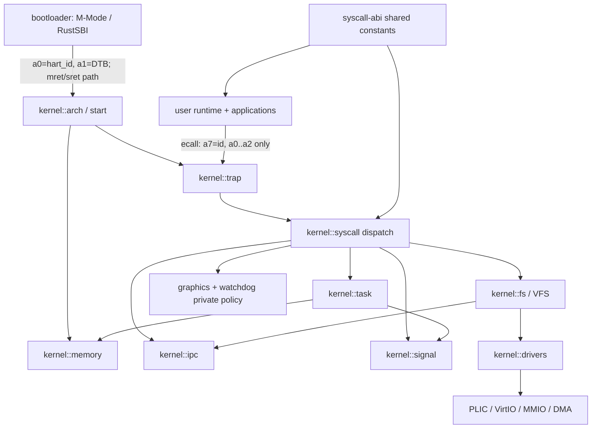

# LiteOS Phase 0 基线审计

审计日期：2026-07-11
仓库基线：`86618e9240d04251cf9b695fdcaa4d967d8b3d23`
工作树基线：审计开始时干净
目标架构：RV64GC，M-Mode bootloader + S-Mode kernel

本报告只记录代码和一手规范能够证明的事实。官方规范的精确版本、上游 commit 与直接链接见 [standards-baseline.md](standards-baseline.md)。

阶段进度：Phase 1 已完成 syscall ABI 收口；Phase 2 已完成 bootloader、hart 启动、trap/FP/TLS、SBI、RFENCE、timer 与 per-hart processor 基础不变量，详见 [phase-2-architecture.md](phase-2-architecture.md)；Phase 3 已建立 interrupt-safe 同步与锁/原子边界，详见 [phase-3-concurrency.md](phase-3-concurrency.md)。下文保留 Phase 0 原始证据，不用后续实现覆盖基线事实。

## 结论

Phase 0 已确认审计基线不能声明 Linux/riscv64 ABI 兼容。Phase 1 修改前，共享 ABI crate 一共定义 78 个 syscall，其中 40 个占用 Linux 编号范围、38 个使用 LiteOS 私有编号。40 个“标准编号范围”入口中，23 个编号与名称或调用语义直接错配；其余入口也大多尚未证明完整结构体、flags、errno、阻塞、信号或并发语义。

当前最小启动骨架是可辨认的，但进程、线程、调度、用户访问和上层策略仍互相缠绕。最严重的基础问题是：

- 用户态统一 syscall 门只传递 `a0..a2`，无法表达 Linux 的 4～6 参数 syscall；
- 未知 syscall 返回 `-1`，而不是 `-ENOSYS`；
- `TaskControlBlock.task_status`、每核 `current`、每核 scheduler、`task_count`、全局任务表和 `wake_time_ns` 共同描述执行状态，状态与队列变更不是一个原子事务；
- `PER_CPU_PROCESSORS` 通过跨核无锁 `static mut` 可变访问实现，存在跨 hart 可变别名；
- 用户指针转换会 panic，并返回无约束的 `&'static mut`；
- 非法 CPU ID 在 `add_task_to_cpu` 中回退到当前 CPU，掩盖内核不变量破坏；
- GUI 所有权、watchdog、进程统计、私有线程 join、共享内存和 Unix socket 策略进入 syscall/任务核心路径。

因此 Phase 1 应先移除私有 ABI 与错误标准号，保留最小启动、控制台、块设备、文件系统和静态 ELF 路径；尚未形成正确语义的标准调用返回 `-ENOSYS`。

## 1. 模块图

目标依赖方向应为 `arch/memory/sync` 提供机制，`task/fs/drivers` 建立领域模型，`syscall` 只做 ABI 解码与 errno 转换。当前反向依赖实例包括 `task_manager -> syscall::graphics`。

## 2. 启动链路

1. `bootloader::_start` 定位每 hart M-Mode trap stack，调用 `rust_main`。
2. 首 hart 清 BSS、解析 DTB、初始化 UART/CLINT/reset/DBCN、构造 RustSBI、设置 PMP 和 HSM 状态，并用 MSIP 启动其他 hart。
3. bootloader 配置 `mideleg`、`medeleg`、`mcounteren` 与 `mtvec`；HSM trap 路径把 `a0=hart_id`、`a1=opaque(DTB)` 交给 S-Mode 入口。
4. kernel `_start` 以 `hart_id * 128 KiB` 选择启动栈，把 hart ID 写入 `tp`；hart 0 清 BSS并以 Release 发布，其他 hart Acquire 等待。
5. `kmain(0)` 初始化 DTB、trap、memory、timer、watchdog、VFS、drivers、signal、init task，再 Release 发布 `INIT_READY`。
6. 次级 hart 激活内核页表，Acquire 等待 `INIT_READY`，再启用 timer/soft/external interrupt。
7. 所有 hart 进入 `task::run_tasks()`。

已确认边界风险：linker 只为 8 个 hart 分配栈，代码以 DTB `smp` 启动 hart；需要在 Phase 2 证明 DTB hart 数不超过内核 `MAX_CORES`，且 bootloader 与 kernel 的 hart-ID/栈边界一致。

## 3. syscall 与 trap 返回链路

1. 用户 `user::syscall(id, [usize; 3])` 把参数写入 `a0..a2`、编号写入 `a7` 后执行 `ecall`。
2. trampoline `__alltraps` 保存通用寄存器、`sstatus`、`sepc`，切换到 kernel SATP 与 kernel stack，跳到 `trap_handler`。
3. `trap_handler` 从 `a7` 取编号、从 `a0..a5` 取六个参数，先将 `sepc += 4`，调用 `syscall::syscall`。
4. dispatch 直接把整数转换成裸用户指针并调用各 handler。
5. 除成功 `execve` 外，返回值写回新/旧 trap context 的 `a0`。
6. `trap_return` 关闭 SIE，获取 user SATP 与 trap-context VA，跳到 trampoline `__restore`；后者切换用户页表、恢复寄存器并 `sret`。

ABI 断点：用户入口只提供 3 参数，内核虽读取 6 参数但 `a3..a5` 未由 wrapper 定义；`mmap`、`clone`、`ppoll` 等无法正确调用。

## 4. 进程创建链路

当前用户 `fork()` 实际发起编号 220。内核把 220 dispatch 到无参数 `sys_fork()`，后者调用 `TaskControlBlock::fork()`：复制地址空间，克隆 fd 表与部分任务字段，设置子 trap context `a0=0`，把子任务同时加入全局任务表和某个 per-CPU scheduler。

Linux/riscv64 编号 220 是五参数 `clone`，不存在 riscv64 `fork` syscall。仓库虽然存在未接入 dispatch 的 `sys_clone`，但它明确忽略 `parent_tid`、`child_tid`、TLS 和完整 `vfork` 语义，因此不能用它替换后宣称 Complete。

## 5. exec 链路

1. 用户 wrapper 构造 NUL 结尾的 path/argv/envp 并调用 221。
2. `sys_execve` 通过当前页表逐项读取字符串，查找内嵌 ELF。
3. `TaskControlBlock::execve_replace` 构造新 `MemorySet`，关闭 CLOEXEC fd、重置信号状态，替换地址空间与 trap context。
4. ELF loader 映射 PT_LOAD、用户栈、trap context；在 argv/envp 非空时建立初始栈。
5. trap handler 识别成功 221，不覆盖新 trap context 的 `a0`，随后统一返回用户态。

已确认差异：初始栈只有 `argc/argv/envp`，没有 auxv；空 argv/envp 时不建立标准初始栈；栈仅按 8 字节对齐；ELF 魔数错误会 `assert` panic；动态链接代码存在但不具备可证明的解释器/TLS/重定位契约。

## 6. 调度链路

1. `TaskManager::add_task` 先写全局 `BTreeMap<PID, Arc<TCB>>`。
2. Ready 任务经 `add_task_to_best_cpu` 加入本地 scheduler 或远端 `inbound`，远端路径发送 IPI。
3. `run_tasks` drain inbound，调用 CFS scheduler `fetch_task`，必要时直接跨核窃取另一个 `Processor.scheduler`。
4. `switch_to_task` 把 `task_status` 从 Ready 改成 Running，设置 `processor.current`，执行 `__switch(idle, task)`。
5. trap/yield/block/exit 取走 `processor.current`，改变状态后 `__switch(task, idle)`。

已确认多权威状态：全局任务表决定“存在”，TCB mutex 决定逻辑状态，scheduler/inbound 决定可运行成员资格，`processor.current` 决定正在运行，`task_count` 独立计数。它们不受同一把锁或同一状态事务保护。

## 7. 阻塞与唤醒链路

- `block_current_and_run_next` 直接把当前任务标成 Sleeping 后切回 idle。
- pipe/Unix socket 自建 `Vec<Weak<TCB>>` wait queue，唤醒时调用 `TaskControlBlock::wakeup -> set_task_status(Ready)`。
- nanosleep 另把 deadline 写入 TCB `wake_time_ns`；timer softirq 遍历全局任务表寻找到期 Sleeping 任务。
- wait/join/signals 各自注册或扫描不同关系，再复用 Sleeping 状态。

当前不存在统一 wait-queue key、入队与条件检查的原子协议。全表扫描是 `O(number_of_tasks)` timer 热路径；不同阻塞原因共享 Sleeping 且没有统一等待所有权，存在错误唤醒和丢失唤醒风险。

## 8. 页表修改与 TLB 链路

- `MemorySet::active` 写 SATP 后执行本地 `sfence.vma`。
- map/unmap/update flags 修改 PTE；多个调用点只执行本地全量 `sfence.vma`。
- softirq 的 SupervisorSoft 路径无条件执行本地全量 `sfence.vma`，同时也承载 timer softirq。
- 未发现把“哪个地址空间、哪个 VA、哪些 hart 正在运行该地址空间”绑定在一起的 shootdown 协议。

用户访问边界更严重：`translated_byte_buffer`、`translated_str` 和 `translated_ref_mut` 遇到未映射地址会 panic；返回 `&'static mut`，没有权限、跨页对象、对齐、别名或地址空间锁生命周期证明。

## 9. 设备中断链路

1. DTB 解析 VirtIO MMIO/IRQ/PLIC/RTC 资源。
2. `device_manager::init` 注册通用块驱动，按 VirtIO device ID 实例化 block/GPU/input，并注册 PLIC handler。
3. S-Mode external interrupt 进入 `trap_handler` 或 kernel trap，调用 `handle_external_interrupt`。
4. handler 从 PLIC 取 pending vectors，再逐项调用已注册设备 handler。
5. VirtIO handler 完成 ring/设备状态并唤醒等待任务。

核心启动只需要 console、block、PLIC/timer 与可选 RTC。GPU/input 当前主要服务 GUI 私有 ABI，列入 Phase 1 删除候选；其 DMA/ring 正确性留到 Phase 10 证明。

## 10. 当前 syscall 完整清单与 Linux/riscv64 对照

状态含义：`Partial` 只表示编号/名称可能匹配但完整语义尚未证明；`Mismatch` 表示该编号明确属于另一个 Linux syscall；`Private` 表示不属于选定 Linux/riscv64 表。

| 编号 | LiteOS 名称 → handler | Linux/riscv64 名称 | 当前状态 | Phase 1 结论 |
|---:|---|---|---|---|
| 17 | GETCWD → `sys_get_cwd` | `getcwd` | Partial | 保留编号，重审语义 |
| 23 | DUP → `sys_dup` | `dup` | Partial | 保留编号，重审 OFD/fd flags |
| 24 | DUP2 → `sys_dup2` | `dup3` | Mismatch | 删除旧入口；仅正确迁移 `dup3` |
| 25 | FCNTL → `sys_fcntl` | `fcntl` | Partial | 保留编号，限制并记录命令子集 |
| 34 | PAUSE → `sys_pause` | `mkdirat` | Mismatch | 删除；迁移已有 `sys_mkdirat` |
| 37 | ALARM → `sys_alarm` | `linkat` | Mismatch | 删除 |
| 48 | SIGNAL → `sys_signal` | `faccessat` | Mismatch | 删除；signal 由 libc/rt 接口表达 |
| 56 | OPEN → `sys_open(path, flags)` | `openat(dirfd,path,flags,mode)` | Mismatch | 删除；迁移 `openat` |
| 57 | CLOSE → `sys_close` | `close` | Partial | 保留编号，重审并发 close |
| 59 | PIPE → `sys_pipe` | `pipe2` | Mismatch | 删除；迁移 `pipe2(flags)` |
| 62 | LSEEK → `sys_lseek` | `lseek` | Partial | 保留编号，重审 offset/errno |
| 63 | READ → `sys_read` | `read` | Partial | 保留编号，重审 user-copy/blocking |
| 64 | WRITE → `sys_write` | `write` | Partial | 保留编号，重审 user-copy/partial I/O |
| 80 | STAT → `sys_stat(path,buf)` | `fstat(fd,stat)` | Mismatch | 删除；迁移 `fstat/newfstatat` |
| 93 | EXIT → `sys_exit` | `exit` | Partial | 保留编号，区分 thread/process exit |
| 101 | NANOSLEEP → `sys_nanosleep` | `nanosleep` | Partial | 保留编号，重审 EINTR/rem |
| 102 | GETUID → `sys_getuid` | `getitimer` | Mismatch | 删除；正确 `getuid` 是 174 |
| 104 | GETGID → `sys_getgid` | `kexec_load` | Mismatch | 删除；正确 `getgid` 是 176 |
| 107 | GETEUID → `sys_geteuid` | `timer_create` | Mismatch | 删除；正确 `geteuid` 是 175 |
| 108 | GETEGID → `sys_getegid` | `timer_gettime` | Mismatch | 删除；正确 `getegid` 是 177 |
| 110 | SHUTDOWN → `sys_shutdown` | `timer_settime` | Mismatch | 删除；标准关机是 `reboot` 142 |
| 124 | YIELD → `sys_sched_yield` | `sched_yield` | Partial | 重命名常量并重审调度语义 |
| 129 | KILL → `sys_kill` | `kill` | Partial | 保留编号，重审进程组/权限/信号 |
| 134 | SIGACTION → `sys_sigaction` | `rt_sigaction` | Mismatch signature | 改为完整 rt 签名或返回 ENOSYS |
| 135 | SIGPROCMASK → `sys_sigprocmask` | `rt_sigprocmask` | Mismatch signature | 改为完整 rt 签名或返回 ENOSYS |
| 139 | SIGRETURN → `sys_sigreturn` | `rt_sigreturn` | Partial | 重命名并重审 signal frame |
| 143 | FLOCK → `sys_flock` | `setregid` | Mismatch | 删除；正确 `flock` 是 32 |
| 146 | SETUID → `sys_setuid` | `setuid` | Partial | 保留编号，重审 credentials |
| 147 | SETGID → `sys_setgid` | `setresuid` | Mismatch | 删除；正确 `setgid` 是 144 |
| 148 | SETEUID → `sys_seteuid` | `getresuid` | Mismatch | 删除；libc 包装到 setresuid |
| 149 | SETEGID → `sys_setegid` | `setresgid` | Mismatch | 删除；libc 包装到 setresgid |
| 172 | GETPID → `sys_get_pid` | `getpid` | Partial | 保留编号，待进程/线程模型修复 |
| 178 | GETTID → `sys_get_tid` | `gettid` | Partial | 保留编号，待 TID/TGID 修复 |
| 214 | BRK → `sys_brk` | `brk` | Partial | 保留编号，重审返回语义 |
| 215 | SBRK → `sys_sbrk` | `munmap` | Mismatch | 删除；`sbrk` 是 libc 包装 |
| 216 | MUNMAP → `sys_munmap` | `mremap` | Mismatch | 删除；正确 `munmap` 是 215 |
| 220 | FORK → `sys_fork` | `clone` | Mismatch | 删除；迁移正确 clone 或 ENOSYS |
| 221 | EXEC → `sys_execve` | `execve` | Partial | 重命名，修复初始栈/auxv |
| 223 | MMAP → 三参数 `sys_mmap` | `fadvise64` | Mismatch | 删除；正确 `mmap` 是 222 且 6 参数 |
| 260 | WAIT → 二参数 `sys_wait_pid` | `wait4` | Mismatch | 删除；迁移完整 `wait4` |

### 10.1 私有编号完整清单

| 私有编号 | 名称 | handler | 标准处理方向 |
|---:|---|---|---|
| 300 | GUI_CREATE_CONTEXT | `sys_gui_create_context` | 删除 GUI syscall/owner |
| 311 | GUI_GET_SCREEN_INFO | `sys_gui_get_screen_info` | 删除 |
| 313 | GUI_FLUSH_RECTS | `sys_gui_flush_rects` | 删除 |
| 315 | GUI_MAP_FRAMEBUFFER | `sys_gui_map_framebuffer` | 删除 |
| 500 | LISTDIR | `sys_listdir` | 删除；未来 `getdents64` 61 |
| 501 | MKDIR | `sys_mkdir` | 删除；迁移 `mkdirat` 34 |
| 502 | REMOVE | `sys_remove` | 删除；迁移 `unlinkat` 35 |
| 503 | READ_FILE | `sys_read_file` | 删除；组合 openat/read/close |
| 504 | CHDIR | `sys_chdir` | 删除；迁移 `chdir` 49 |
| 506 | MKFIFO | `sys_mkfifo` | 删除；未来 `mknodat` 33 + libc |
| 507 | CHMOD | `sys_chmod` | 删除；迁移 `fchmodat` 53 |
| 508 | CHOWN | `sys_chown` | 删除；迁移 `fchownat` 54 |
| 509 | GET_ARGS | `sys_get_args` | 删除；初始栈传递 |
| 700 | GET_PROCESS_LIST | `sys_get_process_list` | 删除 |
| 701 | GET_PROCESS_INFO | `sys_get_process_info` | 删除 |
| 702 | GET_SYSTEM_STATS | `sys_get_system_stats` | 删除 |
| 703 | GET_CPU_CORE_INFO | `sys_get_cpu_core_info` | 删除 |
| 800 | GET_TIME_MS | `sys_get_time_msec` | 删除 |
| 801 | GET_TIME_US | `sys_get_time_us` | 删除 |
| 802 | GET_TIME_NS | `sys_get_time_ns` | 删除 |
| 803 | TIME | `sys_time` | 删除；不保留错误私有号 |
| 804 | GETTIMEOFDAY | `sys_gettimeofday` | 删除；标准号 169 |
| 900 | WATCHDOG_CONFIGURE | `sys_watchdog_configure` | 删除 |
| 901 | WATCHDOG_START | `sys_watchdog_start` | 删除 |
| 902 | WATCHDOG_STOP | `sys_watchdog_stop` | 删除 |
| 903 | WATCHDOG_FEED | `sys_watchdog_feed` | 删除 |
| 904 | WATCHDOG_GET_INFO | `sys_watchdog_get_info` | 删除 |
| 905 | WATCHDOG_SET_PRESET | `sys_watchdog_set_preset` | 删除 |
| 1000 | THREAD_CREATE | `sys_thread_create` | 删除；未来 clone/futex/TLS |
| 1001 | THREAD_EXIT | `sys_thread_exit` | 删除；标准 exit/exit_group |
| 1002 | THREAD_JOIN | `sys_thread_join` | 删除；pthread 用户态逻辑 |
| 2300 | SHM_CREATE | `sys_shm_create` | 删除 |
| 2301 | SHM_MAP | `sys_shm_map` | 删除 |
| 2302 | SHM_CLOSE | `sys_shm_close` | 删除 |
| 5070 | POLL | `sys_poll` | 删除；未来正确 ppoll 73 |
| 5200 | UDS_LISTEN | `sys_uds_listen` | 删除 |
| 5201 | UDS_ACCEPT | `sys_uds_accept` | 删除 |
| 5202 | UDS_CONNECT | `sys_uds_connect` | 删除 |

dispatch 的默认分支当前记录错误并返回 `-1`。Phase 1 必须改为 `-ENOSYS`，且不能为被移除入口保留转发。

## 11. 私有 ABI 内核依赖清单

| 能力 | 入口与直接实现 | 仅/主要服务该能力的内核依赖 | 跨子系统耦合 |
|---|---|---|---|
| GUI | `syscall/graphics.rs` | framebuffer 全局对象、VirtIO-GPU framebuffer 用户映射/刷新 | `task_manager` 退出清理反向调用 syscall GUI owner |
| Watchdog | `syscall/watchdog.rs`, `watchdog.rs` | watchdog core/presets | main 初始化、trap/softirq check、每次调度循环 feed |
| 进程/系统统计 | `syscall/process.rs` 的四个 handler/ABI struct | CPU/memory/task 聚合 | 扫描全局任务表并读取大量独立原子状态 |
| 私有时间 | `syscall/timer.rs` 的 ms/us/ns/time/gettimeofday | 单位转换 wrapper | 与标准时钟 handler 混在同一文件 |
| 私有线程 | process 三个 handler | `spawn_thread`、join manager、thread slots、专用退出清理 | TCB 同时承担进程与线程资源 |
| 私有 SHM | memory 三个 handler | `SHM_REGISTRY`、handle/id/segment | 绕开 fd/open-file model |
| 私有 UDS | fs 三个 handler | `ipc/unix_socket.rs` 全局路径 listener | 独立阻塞/唤醒模型 |
| 私有 poll | `sys_poll` | 各 inode 自定义 poll mask/poller | 非标准 timeout/sigmask；`sys_ppoll` 只是包装私有 poll |
| 私有路径/参数 | fs/process handlers | FIFO registry、任务 args/envs side channel | 绕过 *at/getdents/初始栈 |

## 12. 私有 ABI 用户态依赖与可删除应用

| 用户能力 | wrapper/库 | 直接依赖应用 |
|---|---|---|
| GUI/poll | `gfx.rs`, `webcore/`, `PollFd/poll` | `webwm` |
| SHM/UDS | `litegui.rs` | 当前无启动应用；库本身为孤儿 |
| watchdog | `syscall.rs` watchdog API | `tests_watchdog` |
| 统计 | `ProcessInfo/SystemStats` 与 wrapper | `top`, `tests_system` |
| 私有线程 | thread create/exit/join | `tests_threads` |
| 私有时间 | ms/us/ns/time/gettimeofday wrapper | `tests_time` |
| 私有目录/元数据 | listdir/mkdir/remove/read_file/chdir/mkfifo/chmod/chown | `ls`, `mkdir`, `rm`, `cat`, shell completion/builtin；相关测试程序 |
| GET_ARGS | `get_args` | `cat`, `echo`, `kill`, `ls`, `mkdir`, `rm`, `vim`, `tests_process` |
| 私有关机 | `shutdown` | `exit` |

仓库规则禁止维护或修正测试程序。`tests_watchdog`、`tests_system`、`tests_threads`、`tests_time` 以及只验证被删除私有功能的测试程序应作为孤儿删除，而不是迁移成另一套私有测试框架。

## 13. 最小可构建、可启动骨架

必须保留：

- M-Mode bootloader：DTB、UART、CLINT/ACLINT、PMP、RustSBI HSM/timer/IPI/reset；
- S-Mode arch/trap/timer/PLIC 与 per-hart 启动；
- 物理内存、内核页表、用户地址空间、kernel stack、统一 user-copy 边界；
- 一个调度器、一个任务状态机、最小 process/thread 模型；
- VirtIO block、一个根文件系统、dev console；
- 正确编号的 `read/write/close/exit/execve` 和形成启动闭环所需的最小文件/进程 syscall；
- 静态 ELF `_start`、最小 init；shell 只有在其依赖迁移为标准 ABI 后保留。

当前可先删除：GPU、input、GUI/web、watchdog、统计、私有线程 API、私有 SHM、私有 UDS、私有 poll 以及对应用户程序。动态 ELF 支持冻结，Phase 12 决定是否先删除。

## 14. 已确认问题（按严重度）

### Blocker

1. `syscall-abi/src/lib.rs` + `kernel/src/syscall/mod.rs` + `user/src/syscall.rs`：23 个 Linux 编号被错误名称/签名占用。后果是标准程序调用完全不同的内核功能，例如 110 `timer_settime` 会关机。
2. `user/src/syscall.rs::syscall`：只传三参数。后果是 Linux `openat/mmap/clone/ppoll/wait4` 无法按 ABI 调用。
3. `kernel/src/syscall/mod.rs` 默认分支：未知 syscall 返回 `-1` 而不是 `-ENOSYS`。
4. 私有 syscall 从共享 ABI、dispatch 到用户应用全链存在，直接阻止“唯一 Linux/riscv64 ABI”成立。

### Critical

1. `memory/page_table.rs::translated_*`：用户输入可触发 panic；返回 `&'static mut`，破坏生命周期和别名边界。
2. `task/processor.rs::PER_CPU_PROCESSORS`：各 hart 和工作窃取路径对 `static mut` 取得无锁可变引用，无法证明无跨核别名/数据竞争。
3. `task/processor.rs::add_task_to_cpu`：非法 CPU ID 回退当前 CPU，掩盖内核不变量破坏。
4. `task_manager` 状态、scheduler membership、per-CPU current、inbound、task_count 非事务更新，存在重复入队、错误计数、Running/Ready 与队列不一致风险。
5. `schedule_with_task_context`/`switch_to_task` 在释放 `TaskContext` mutex 后使用内部裸指针跨上下文切换；Arc 只保证 TCB 分配存活，不能证明该字段无并发写入。
6. ELF loader 对用户 ELF 使用 `assert_eq!`，普通无效输入会 panic 内核。

### Major

1. `TaskControlBlock` 同时拥有进程资源、线程寄存器、调度字段、统计、credentials、等待 deadline 和线程槽位。
2. `SchedulingPolicy` 可被修改，但 Processor 始终构造 CFS；FIFO/Priority 模块形成装饰性双轨。
3. nanosleep 在 timer/softirq 路径全任务表扫描；pipe/UDS/wait/join 各有等待机制。
4. `execve` 初始栈缺 auxv，空参数路径甚至不写 argc/argv/envp；不能支撑 musl 启动契约。
5. 页表修改没有地址空间感知的跨核 TLB shootdown 协议。
6. VFS 把 cwd 从当前 task 全局读取，路径解析、mount、FIFO/device 特判集中在单一对象；fd 与 open-file-description 边界仍需重审。
7. task 核心反向依赖 `syscall::graphics`，watchdog 横穿 main/trap/scheduler。

### Minor

1. README/AGENTS/CLAUDE 声称“Linux/musl 兼容”“50+ 调用”，与代码不符；还引用不存在的旧路径。
2. init 保留未调用的 `spawn_webwm`/`spawn_text_test`，用户库默认编译 GUI/web/测试模块。
3. 大量注释宣称“统一”“唯一权威”“安全”“Linux 标准”，但代码没有对应不变量证明。

## 15. 终态设计约束

- syscall-abi 是内核与用户态唯一编号/布局契约，只包含选定 Linux/riscv64 子集。
- syscall 层只解码寄存器、复制用户数据、调用子系统接口并转换 errno。
- Process 拥有地址空间、fd table、cwd、credentials、signal disposition、children/wait；Thread 拥有 TID、kernel stack、trap context、TLS、signal mask、clear-child-tid；SchedulingEntity 拥有 run state 与唯一 queue membership。
- `run_state + queue/current membership` 必须在一个明确同步协议中变更；全局 PID/TID 索引只负责身份/生命周期，不是第二调度状态源。
- 用户内存 API 不返回长期 Rust 引用，以有界 copy-in/copy-out 表达 EFAULT 和部分复制。
- 阻塞对象统一使用 wait queue；条件检查、入队和睡眠必须防止 lost wakeup。
- 页表修改记录 address space 与 active-hart mask，按需执行本地/远端 `sfence.vma`。
- GUI、watchdog 策略、统计展示、pthread join 和 libc 包装全部离开内核 syscall 核心。

## 16. Phase 1 逐步计划

1. 固定 dispatch 的 `-ENOSYS` 行为，删除 38 个私有常量、match arm 与用户 wrapper → verify: `rg SYSCALL_` 不再发现私有号。
2. 删除 GUI/Web/watchdog/统计/私有线程/SHM/UDS/poll 的用户应用和孤儿库 → verify: user manifest/Makefile/FS 镜像不再构建或打包它们。
3. 删除仅服务私有 ABI 的内核 handler、registry、owner 和跨层钩子 → verify: syscall 不再依赖 graphics/watchdog/私有 IPC。
4. 删除 23 个错误标准号或签名入口与 wrapper → verify: 每个剩余常量的编号、名称和参数形状与固定 Linux 表一致。
5. 不在 Phase 1 仓促迁移 `*at`、`pipe2`、`fstat`、`munmap`；未实现标准调用统一保持 ENOSYS → verify: 无旧编号转发和双轨 handler。
6. 把用户 syscall 原语扩展为六参数寄存器契约，并让所有 wrapper 显式提供六参数 → verify: `a0..a5/a7` 与内核读取一致。
7. 缩减 init/user 构建集合到最小静态启动路径 → verify: 不依赖私有 ABI，相关 crate 与 workspace 构建通过。
8. 更新 README 与 ABI 矩阵 → verify: 不再宣称未证明兼容性。

## 17. 验证方式与剩余风险

Phase 0 执行的是只读静态扫描和官方 UAPI 对照，没有运行或修改测试。Phase 1 允许的验证是 `cargo fmt --check`、相关 crate `cargo check/build`、workspace/build 链路、ELF/符号检查和最小启动观察。

尚未证明的真实风险：M/S privilege 配置、SBI/HSM 发布、nested interrupt、PLIC completion、VirtIO DMA memory ordering、allocator、PTE 权限/W^X、signal frame、futex、fork/clone/exec 生命周期、VFS/OFD、文件系统 crash semantics。它们分别留给 Phase 2～12，不因 Phase 0 的结构扫描而视为正确。

## 18. Phase 1 执行进度

第一批已完成进程/系统统计私有 ABI 的整链删除：

- 删除 `700..703` 四个共享常量和 dispatch arm；
- 删除四个内核 handler、三套私有 ABI struct、只服务统计导出的任务表聚合 API 和 active-core 计数链；
- 删除对应用户 wrapper/struct；
- 删除 `top` 和只验证该私有 ABI 的 `tests_system`；
- 反向搜索无残留引用，当前共享 ABI 常量从 78 降为 74，私有常量从 38 降为 34。

第二批已完成 GUI/Web/看门狗私有 ABI 及其独占依赖的整链删除：

- 删除 GUI 的 `300/311/313/315` 和看门狗的 `900..905` 共十个共享常量、dispatch arm 与内核 handler；
- 删除 framebuffer、VirtIO GPU、VirtIO input 和 devfs，以及 device manager、VFS、trap、softirq、scheduler、main 中仅服务这些模块的反向依赖与钩子；
- 删除用户态 `gfx`、`litegui`、`protocol`、`webcore`、`webwm` 和 `tests_watchdog`，同时删除两个字体资源；
- 从用户依赖、QEMU 启动参数、文件系统镜像脚本和 init 中删除对应 crate、设备、资源目录及启动路径；
- 反向搜索无残留引用，当前共享 ABI 常量从 74 降为 64，私有常量从 34 降为 24。

第三批已完成 `800..804` 私有时间 ABI 的删除：

- 删除毫秒/微秒/纳秒读取、`time`、`gettimeofday` 五个私有常量、dispatch arm、内核 handler 和用户 wrapper；
- 删除只属于该 ABI 的 `TimeVal`、便利函数和 `tests_time`；
- 保留内核调度、睡眠与超时依赖的单调时钟实现，并保留标准号 `101` 上的 `nanosleep`/`TimeSpec`；
- 反向搜索无私有时间 ABI 残留，当前共享 ABI 常量从 64 降为 59，私有常量从 24 降为 19。

第四批已完成 SHM/poll/UDS 私有 IPC 的整链删除：

- 删除 `2300..2302`、`5070`、`5200..5202` 七个共享常量、dispatch arm、内核 handler 和用户 wrapper；
- 删除 SHM registry/物理帧映射实现及 Unix domain socket 模块；
- 删除仅服务私有 poll 的 `Inode` hook、pipe poll waiter、ext2 覆写和未接入 dispatch 的 `sys_ppoll` 草稿；
- 保留匿名 pipe/FIFO 的创建、打开、读写等待队列以及只覆盖这些标准文件语义的 `tests_ipc` 源文件；
- 反向搜索无 SHM/poll/UDS 私有 ABI 残留，当前共享 ABI 常量从 59 降为 52，私有常量从 19 降为 12。

第五批已完成 `1000..1002` 私有线程 ABI 与双轨线程草稿的整链删除：

- 删除三个共享常量、dispatch arm、内核 handler、用户 wrapper 和只验证该 ABI 的 `tests_threads`；
- 删除 join manager、线程专用退出路径、TCB 的 `tgid/thread_slot/thread_slots` 与 `spawn_thread`；
- 删除从未接入 syscall dispatch、且复用上述私有线程状态的 `sys_clone/clone_with_flags` 双轨草稿；
- 将用户地址空间从 64 页线程 TrapContext 窗口收回为单一 TrapContext 页，并相应简化内核栈布局锚点；
- 保留标准 `gettid`、fork、futex、SignalState 及其独立依赖；反向搜索无私有线程残留，当前共享 ABI 常量从 52 降为 49，私有常量从 12 降为 9。

第六批完成最后九个私有文件/参数 ABI、错误标准号和上层依赖的收敛：

- 删除 `500..509` 九个私有常量、dispatch、handler 与 wrapper；目录、文件便捷读取、FIFO 和参数旁路不再存在；
- 删除 Phase 0 矩阵标记为 Mismatch 或完整签名不匹配的 23 个入口，包括旧式 `dup2/open/pipe/fork/wait/sbrk`、错误编号的 credentials/mmap/munmap 和不完整 `rt_sigaction/rt_sigprocmask`；
- 删除对应 syscall 草稿、私有 pipe/FIFO、flock、futex、动态链接 syscall、父子/join 状态和 TCB 的内核参数副本；
- 用户态只保留 `/bin/init`，init 仅调用标准号 `sched_yield(124)`；镜像脚本使用 `/bin/init` 显式 allowlist，旧 target ELF 不会重新进入镜像；
- 用户 syscall gate 显式装载 `a0..a5/a7`，trap 显式读取 `x10..x15/x17`；所有保留 wrapper 都提供六个参数；
- dispatch 默认返回 `-ENOSYS`，不存在旧号转发或条件兼容；
- ELF loader 即使面对空 argv/envp 也写入 `argc=0, argv=NULL, envp=NULL`，初始栈成为唯一参数来源；auxv 仍留给 Phase 12 完整实现。

Phase 1 最终共享 ABI 为 17 项，均已核对 Linux/riscv64 编号和参数形状：

| 编号 | 常量 | handler | Phase 1 证据状态 |
|---:|---|---|---|
| 17 | `GETCWD` | `sys_get_cwd(buf,len)` | 编号/形状匹配，语义待 Phase 8 |
| 23 | `DUP` | `sys_dup(fd)` | 编号/形状匹配，OFD 语义待 Phase 8 |
| 25 | `FCNTL` | `sys_fcntl(fd,cmd,arg)` | 编号/形状匹配，仅保留已记录命令子集 |
| 57 | `CLOSE` | `sys_close(fd)` | 编号/形状匹配，语义待 Phase 8 |
| 62 | `LSEEK` | `sys_lseek(fd,offset,whence)` | 编号/形状匹配，语义待 Phase 8 |
| 63 | `READ` | `sys_read(fd,buf,len)` | 编号/形状匹配，user-copy/阻塞待后续阶段 |
| 64 | `WRITE` | `sys_write(fd,buf,len)` | 编号/形状匹配，user-copy/partial I/O 待后续阶段 |
| 93 | `EXIT` | `sys_exit(status)` | 编号/形状匹配，进程/线程语义待 Phase 3 |
| 101 | `NANOSLEEP` | `sys_nanosleep(req,rem)` | 编号/形状匹配，EINTR/rem 待 Phase 7 |
| 124 | `SCHED_YIELD` | `sys_sched_yield()` | 编号/形状匹配，调度语义待 Phase 6 |
| 129 | `KILL` | `sys_kill(pid,sig)` | 编号/形状匹配，权限/进程组待 Phase 5 |
| 139 | `RT_SIGRETURN` | `sys_rt_sigreturn()` | 编号/形状匹配，signal frame 待 Phase 5 |
| 146 | `SETUID` | `sys_setuid(uid)` | 编号/形状匹配，credentials 待 Phase 3 |
| 172 | `GETPID` | `sys_get_pid()` | 编号/形状匹配，PID/TGID 模型待 Phase 3 |
| 178 | `GETTID` | `sys_get_tid()` | 编号/形状匹配，当前单线程模型中等于 PID |
| 214 | `BRK` | `sys_brk(addr)` | 编号/形状匹配，Linux 失败返回语义待 Phase 4 |
| 221 | `EXECVE` | `sys_execve(path,argv,envp)` | 编号/形状匹配，auxv/musl 契约待 Phase 12 |

Phase 1 六批累计修改 93 个文件，增加 442 行、删除 27,629 行；`syscall-abi` 从 78 项收缩到 17 项，38 个已知私有入口全部删除，Phase 0 已知的错误编号/签名入口全部从共享表和 dispatch 删除。

六批完成后的验证结果：`cargo check --workspace`、`make build-kernel`、`make build-user`、`make build-bootloader` 均通过。根目录 `cargo build --workspace` 会绕过成员 crate 的 RISC-V target 配置并调用 macOS 宿主汇编器，因 `ecall`/RISC-V section 失败，不作为目标构建结果。`cargo fmt --all --check` 因审计前已有的大量全仓格式差异失败；未执行全仓格式化，`git diff --check` 与 `create_fs.py` AST 解析通过。未运行测试。
